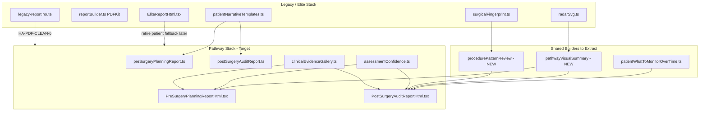

# HA-PDF-ENHANCE-1 — Legacy Report Feature Audit

**Date:** 2026-06-25  
**Scope:** Audit and design only — no production code changes.  
**Goal:** Identify valuable legacy/elite report elements worth adapting into pre-surgery and post-surgery pathway reports.

---

## Executive Summary

The **elite/legacy report stack** (`EliteReportHtml.tsx`, `reportBuilder.ts`, `legacy-report/route.ts`) contains several **high-value patient education and visual explanation patterns** that the new pathway reports (`PreSurgeryPlanningReportHtml.tsx`, `PostSurgeryAuditReportHtml.tsx`) do not yet replicate. The pathway reports are stronger on **pathway-specific structure**, **assessment confidence**, **review inputs transparency**, and **long-term preservation / future hair-loss modules** — but they are **weaker on cross-domain visual summaries**, **surgical fingerprint storytelling**, **timeline-based monitoring guidance**, and **rich per-domain “what this means” copy**.

**Worth preserving (with patient-safe adaptation):**

| Category | Legacy source | Recommendation |
|----------|---------------|----------------|
| Domain health visual | `radarSvg.ts`, elite score badge layout | Simplified **domain health chart** (no “diagnostic radar” label) |
| Qualitative domain cards | `patientDomainAssessment.ts`, `patientNarrativeTemplates.ts`, elite domain grid | **Patient-safe domain cards** with plain-English blocks |
| Procedure pattern summary | `surgicalFingerprint.ts` | **Procedure pattern review** section (already patient-labeled in elite) |
| Monitoring timeline | `patientWhatToMonitorOverTime.ts` | Add to **post-surgery** (and optionally pre-surgery planning) |
| Photo evidence UX | Elite `forensicBoard` grouping | Upgrade pathway **clinical evidence gallery** with grouped observations |
| Confidence / completeness | Elite confidence panels + pathway `assessmentConfidence.ts` | **Merge** into one patient-safe indicator |

**Do not port verbatim:** PDFKit `reportBuilder.ts` branding (“AI Score”, “Platinum”, “Follicle Intelligence”), `DomainScoreCards.tsx` (“AI Vision” pills), `AuditScoreBadge.tsx` (“Poor” label), auditor-only Evidence Intelligence layer, Graft Integrity Index in patient PDFs, raw forensic narrative/red-flag tables.

**Recommended first implementation:** **HA-PDF-VISUAL-2** — patient-safe visual domain summary using existing `radarSvg.ts` with relabeled axes and no numeric overall score bubble for patients.

**Legacy/elite features inventoried:** **42** distinct visual sections, graphs, or copy blocks (see inventory table).

---

## Legacy Feature Inventory

| # | File path | Visual / section name | What it communicates | Patient-safe? | Clinically useful? | Pathway fit | Reuse strategy |
|---|-----------|----------------------|----------------------|---------------|-------------------|-------------|----------------|
| 1 | `src/lib/reports/EliteReportHtml.tsx` | Hero + meta block | Report identity, case ID, date, confidence band | Yes (patient labels) | Low | Both | Adapt layout only |
| 2 | `src/lib/reports/EliteReportHtml.tsx` | Overall score bubble + tier tag | Single 0–100 surgical quality score | **Adapt** — patient uses qualitative bands; auditor shows tiers | Medium | Post-surgery (optional summary) | **Adapt with safety rewrite** — hide Platinum/Gold; use outcome bands |
| 3 | `src/lib/reports/radarSvg.ts` + elite `radarPanel` | Diagnostic Radar Signature | Multi-domain performance shape + center overall/confidence | **Adapt** — rename, soften center text | High | Post-surgery primary; pre-surgery simplified | **Adapt** — patient “Domain health overview” |
| 4 | `src/lib/pdf/renderRadarChart.ts` | Radar PNG (PDFKit embed) | Same as radar SVG for PDFKit path | **Adapt** | High | Both PDF | Reuse SVG path in Playwright; retire PNG or keep auditor-only |
| 5 | `src/lib/pdf/reportBuilder.ts` | `addScoreBadge` | Large circular AI score + tier classification | **No** as written (“AI Score”, “Platinum”) | Medium | Auditor-only | Auditor-only or rewrite |
| 6 | `src/lib/pdf/reportBuilder.ts` | `addConfidencePanel` | Photos, missing categories, model confidence | **Adapt** — drop “AI” icon/labels | High | Both | Merge with `assessmentConfidence.ts` |
| 7 | `src/lib/reports/EliteReportHtml.tsx` | Key Metrics card (6 rows) | Donor quality, survival, transection, density, hairline, scar | **Adapt** — metric names OK; values need evidence gating | High | Post-surgery | Adapt copy + missing-evidence handling from elite |
| 8 | `src/lib/reports/EliteReportHtml.tsx` | Evidence Intelligence Layer | Per-metric documentation completeness | **No** for patients | High | Auditor-only | Auditor-only |
| 9 | `src/lib/reports/EliteReportHtml.tsx` | Review confidence / Photos reviewed KPI grid | Confidence % and photo counts by view type | Yes | High | Both | **Reuse directly** (already in pathway via `assessmentConfidence`) |
| 10 | `src/lib/reports/EliteReportHtml.tsx` | Risk strip (4 pills) | Donor risk, recipient consistency, doc completeness, implant confidence | **Adapt** — “Watch/Stable” language is calm | Medium | Post-surgery | Adapt labels; avoid “risk” in patient headings |
| 11 | `src/lib/reports/EliteReportHtml.tsx` | Domain cards grid (8 domains) | Per-domain observation, evidence bullets, monitoring | Yes (patient mode) | High | Post-surgery; partial pre-surgery | **Adapt** — map to pathway section IDs |
| 12 | `src/lib/reports/patientDomainAssessment.ts` | Qualitative domain assessment pill | “Within expected range”, “Worth discussing…” | Yes | High | Both | **Reuse directly** |
| 13 | `src/lib/reports/patientNarrativeTemplates.ts` | Plain-English meaning blocks | Clinical finding → plain English → implication → follow-up | Yes | High | Both | **Reuse directly** via shared section builder |
| 14 | `src/lib/reports/surgicalFingerprint.ts` | Procedure pattern review (5 cards) | Extraction, recipient, hairline, density, direction patterns | Yes (elite renames for patient) | High | Post-surgery; donor sections pre-surgery | **Adapt** — wire to pathway reports |
| 15 | `src/lib/reports/EliteReportHtml.tsx` | Fingerprint strength dot stripe | Visual strength 0–100 per pattern | Yes | Medium | Post-surgery | Reuse with qualitative bands instead of numeric strength |
| 16 | `src/lib/reports/EliteReportHtml.tsx` | Clinical overview concern band | Overall concern label + plain-English summary | Yes | High | Both | Partially duplicated by pathway outcome hero — **merge** |
| 17 | `src/lib/reports/EliteReportHtml.tsx` | What looks reassuring / Areas to discuss | Highlights vs review areas two-column | Yes | High | Both | Post-surgery concerns section exists — **enrich** with positive column |
| 18 | `src/lib/reports/patientSafeSummary.ts` (via elite) | What happens next | Ordered next steps + reassurance | Yes | High | Both | Pathway reports have next steps — **reuse copy source** |
| 19 | `src/lib/reports/patientWhatToMonitorOverTime.ts` | What to Monitor Over Time timeline | 0–3, 3–6, 6–12, 12+ month bullets | Yes | High | Post-surgery; optional pre-surgery | **Reuse directly** |
| 20 | `src/lib/reports/patientLongTermHairEducation.ts` | Protecting native hair / donor options grid | DHT, LED, PRP, exosomes, donor protection education | Yes | High | Both | Pathway has `longTermHairPreservation.ts` — **compare & merge** best copy |
| 21 | `src/lib/reports/EliteReportHtml.tsx` | Visual evidence / forensic board | Grouped photos: pre-op, donor day-0, recipient, intra, post-op | Yes (patient labels) | High | Both | **Adapt** — upgrade `clinicalEvidenceGallery.ts` |
| 22 | `src/lib/reports/EliteReportHtml.tsx` | Per-group observation + confidence pill | What was reviewed in each photo group | Yes | High | Both | **Adapt into gallery** |
| 23 | `src/lib/reports/EliteReportHtml.tsx` | Photo coverage / limitations panel | Missing categories, coverage narrative | Yes | High | Both | Partially in `assessmentImprovementRecommendations` — unify |
| 24 | `src/lib/reports/EliteReportHtml.tsx` | Image-limited audit banner | Override notice when assessment image-limited | Yes | High | Both | **Reuse directly** (pathway already supports flag) |
| 25 | `src/lib/pdf/reportBuilder.ts` | Score by Domain (v1) table | Raw/confidence/grade/weighted per domain | **No** for patients | High | Auditor-only | Auditor-only |
| 26 | `src/lib/pdf/reportBuilder.ts` | Score by Area bar rows | Domain bars 0–100 with color bands | **Adapt** — qualitative only for patients | Medium | Post-surgery | Simpler bar chart without raw numbers |
| 27 | `src/lib/pdf/reportBuilder.ts` | Graft Integrity Index card | Claimed vs estimated graft ranges | **No** for patients unless auditor-approved | High | Auditor-only | Keep auditor-only |
| 28 | `src/lib/pdf/reportBuilder.ts` | Clinical Narrative + Key Findings cards | Severity-pilled findings, red flags | **No** for patients | High | Auditor-only | Auditor-only |
| 29 | `src/lib/pdf/reportBuilder.ts` | Case Photos 3-column grid | Thumbnail gallery with labels | Yes | Medium | Both | Superseded by `clinicalEvidenceGallery` — merge best layout |
| 30 | `src/app/api/print/legacy-report/route.ts` | Clinical Scorecard + grade pill | Overall score + grade + confidence | **Adapt** | Medium | Legacy only | Retire after migration |
| 31 | `src/app/api/print/legacy-report/route.ts` | Score by Area cards (X/5, High/Med/Low) | Rubric domain breakdown | **Adapt** | Medium | Optional post-surgery | Use `ScoreAreaGraph` pattern qualitatively |
| 32 | `src/components/reports/ScoreAreaGraph.tsx` | Area score bar graph (web) | Domain/section bars with X/5 | **Adapt** — avoid “score” emphasis for patients | Medium | Post-surgery auditor web | Auditor web; patient PDF uses qualitative cards |
| 33 | `src/components/reports/DomainScoreCards.tsx` | Evidence-weighted Domains v1 | Benchmark, drivers, limiters, AI Vision pills | **No** for patients | High | Auditor-only | Auditor-only |
| 34 | `src/components/reports/AuditScoreBadge.tsx` | Score badge (Excellent/Acceptable/Poor) | Compact numeric badge | **No** — “Poor” forbidden tone | Low | Retire | Do not reuse in patient UI |
| 35 | `src/lib/reports/EliteReportHtml.tsx` | Predictive Outlook | Graft survival expectation narrative | **Adapt** — avoid unsupported certainty | Medium | Post-surgery | Adapt with evidence gating |
| 36 | `src/lib/reports/EliteReportHtml.tsx` | Premium: Graft Integrity + Auditor Validation | GII status, human auditor notes | **No** for patients | High | Auditor-only | Auditor-only |
| 37 | `src/lib/reports/EliteReportHtml.tsx` | Doctor / Clinic submission block | Procedure type, graft counts, staff | **No** for patients | Medium | Auditor/doctor | Auditor-only |
| 38 | `src/lib/reports/EliteReportHtml.tsx` | Debug footer | Renderer, mode, case version | **No** | Low | Internal | Dev-only |
| 39 | `src/lib/pdf/reportBuilder.ts` | Follicle Intelligence watermark | Brand watermark on every PDF page | **No** for patients | None | Retire patient path | Remove from patient PDFs |
| 40 | `src/app/reports/[caseId]/html/page.tsx` | Forensic audit table (auditor mode) | Key findings, red flags, domain v1, benchmark | **No** for patients | High | Auditor-only | Keep auditor HTML preview |
| 41 | `src/lib/evidence/evidenceMissingCopy.ts` (used by elite) | Missing-evidence metric explainers | Why a metric shows “insufficient” | Yes | High | Both | **Reuse** in pathway scorecards |
| 42 | `src/lib/reports/patientConcernBands.ts` (used by elite) | Concern band colors/labels | none/minor/needs_review/significant/urgent | Yes (patient labels) | High | Both | **Reuse directly** — already shared |

---

## Old vs New Report Comparison

### Old / elite report strengths

- **Rich visual executive dashboard:** score bubble + radar + key metrics on page 1 (`EliteReportHtml.tsx` lines ~1666–1697).
- **Eight-domain narrative grid** with structured sub-headings: Clinical finding, Plain-English meaning, Why this matters, Evidence, Confidence explanation, Monitoring guidance.
- **Surgical fingerprint storytelling** — five pattern cards with confidence pills and strength visualization (`surgicalFingerprint.ts`).
- **Grouped photo evidence board** with timeline categories and per-group observations (`EliteReportHtml.tsx` `mapToEvidenceGroup`, `photoGroups`).
- **Dedicated patient education blocks:** long-term preservation options grid + 4-period monitoring timeline (static, calm copy).
- **Balanced findings layout:** positive indicators alongside areas to discuss (patient-safe framing).
- **Evidence completeness UX:** Evidence Intelligence layer (professional) + missing-evidence compact explainers on metrics.

### New pre-surgery report strengths

- **Pathway-specific planning outcome hero** (`PreSurgeryPlanningReportShell.tsx`, `planningOutcomeId`).
- **Planning-focused scorecards:** progression risk, donor strength, restoration suitability, graft range, preservation, stabilisation priority (`preSurgeryPlanningReport.ts`).
- **Structured review sections** aligned to planning decisions (7 sections vs generic domains).
- **Assessment confidence + improvement recommendations** modules shared with post-surgery (`assessmentConfidence.ts`, `assessmentImprovementRecommendations.ts`).
- **Future hair loss progression risk** + **long-term preservation** (`futureHairLossProgressionRisk.ts`, `longTermHairPreservation.ts`).
- **Clinical evidence gallery** component shared web/PDF (`clinicalEvidenceGallery.ts`).
- **Intelligence bundle integration** for Norwood, donor band, graft estimates (`HairAuditIntelligenceBundle`).

### New post-surgery report strengths

- **Procedural outcome hero** with repair consideration state (`PostSurgeryAuditReportShell.tsx`).
- **Post-op scorecards:** donor preservation %, extraction, density, recipient qualitative, healing, repair probability.
- **Concern flags** with severity badges (patient-safe wording via `sanitizePatientReportText`).
- **Repair planning guidance** section (pathway-specific).
- **Known clinical context** lines from patient-safe summary.
- **Image-limited assessment** handling aligned with override notices.
- **Shared confidence / inputs / gallery** infrastructure with pre-surgery.

### Missing patient value in new reports

| Missing element | Patient impact |
|-----------------|----------------|
| Cross-domain **visual summary** (radar or simplified chart) | Harder to grasp “shape” of review at a glance |
| **Surgical fingerprint / procedure pattern** cards | Loses intuitive donor/recipient/hairline pattern storytelling |
| **Per-domain “plain English meaning”** blocks | Pathway sections are single paragraphs — less scannable education |
| **What to monitor over time** timeline | Post-surgery patients lack structured healing milestone guide |
| **Positive indicators** column | New reports emphasize concerns; reassuring findings less visible |
| **Grouped photo observations** | Gallery shows images but not elite-level group context panels |
| **Compact status strip** (donor/recipient/doc/implant) | Useful at-a-glance status without reading full sections |

### Duplicated or weaker sections in new reports

| Area | Issue |
|------|--------|
| Long-term education | Both `patientLongTermHairEducation.ts` (elite) and `longTermHairPreservation.ts` (pathway) exist — similar intent, different copy; risk of drift |
| Confidence | Elite confidence KPI grid + pathway `AssessmentConfidenceSection` — overlap; should be one shared builder |
| Photo gallery | Elite forensic board is richer; pathway `ClinicalEvidenceReviewGallery` is cleaner but thinner |
| Overall summary | Elite `clinicalOverview` concern band vs pathway outcome hero — both valid; should not duplicate conflicting messages |
| Score presentation | Pathway scorecards show raw `%` for some metrics — may feel more “scored” than elite patient qualitative domain pills |

---

## High-Value Upgrade Candidates

### High value / low risk

| Rank | Candidate | Source | Target pathway | Notes |
|------|-----------|--------|----------------|-------|
| 1 | Patient-safe **domain health chart** (simplified radar) | `radarSvg.ts` | Post-surgery; optional pre-surgery | Relabel axes; remove “Diagnostic”; hide center overall score for patients |
| 2 | **What to monitor over time** timeline section | `patientWhatToMonitorOverTime.ts` | Post-surgery | Static copy; drop-in section |
| 3 | **Qualitative domain assessment pills** on scorecards | `patientDomainAssessment.ts` | Both | Replace or supplement raw `%` display |
| 4 | **Positive indicators** (“What looks reassuring”) block | Elite findings two-col | Post-surgery | Use `patientSafeSummary.acceptableHighlights` |
| 5 | **Per-group photo observation panels** | Elite `evidenceObsPanel` | Both | Extend `clinicalEvidenceGallery.ts` |

### High value / medium risk

| Rank | Candidate | Source | Risk | Mitigation |
|------|-----------|--------|------|------------|
| 6 | **Procedure pattern review** (surgical fingerprint) | `surgicalFingerprint.ts` | Pattern labels could sound diagnostic | Keep “may/might”; show limitations; patient section title only |
| 7 | **Patient narrative blocks** for pathway sections | `patientNarrativeTemplates.ts` | Copy length in PDF | Map 4–6 domains max; collapse on pre-surgery |
| 8 | **Unified assessment confidence** (merge elite KPI + pathway module) | Multiple files | Regression in PDF layout | Single `buildAssessmentConfidence` consumer |
| 9 | **Compact review status strip** | Elite `riskStrip` | “Risk” wording | Rename to “Review status” / “Areas to keep an eye on” |
| 10 | **Merge long-term education** sources | `patientLongTermHairEducation.ts` + `longTermHairPreservation.ts` | Copy inconsistency | One content builder, pathway-aware variants |

### High value / high risk

| Rank | Candidate | Source | Risk |
|------|-----------|--------|------|
| 11 | Key metrics row with survival/transection labels | Elite key metrics | Unsupported certainty; forensic metric names |
| 12 | Overall numeric score bubble on page 1 | Elite score badge | Feels like “Precision Score”; patient forbidden tier names in auditor variant |
| 13 | Predictive graft survival outlook | Elite predictive outlook | Medical-adjacent prediction |

### Low value / remove later

| Item | Reason |
|------|--------|
| `AuditScoreBadge.tsx` | Superseded; “Poor” label; minimal UX value |
| `renderRadarChart.ts` PNG pipeline | Playwright uses inline SVG; PDFKit radar disabled |
| PDFKit `addScoreBadge` AI branding | Wrong tone for patient products |
| Legacy route score-by-area X/5 cards | Duplicates `ScoreAreaGraph`; tied to retiring route |
| Follicle Intelligence watermark | Internal branding leak |
| Evidence Intelligence layer in any patient template | Professional forensic framing |

---

## Patient Safety Review

### Forbidden / risky terms in legacy (must not appear in patient pathway output)

| Term / pattern | Location | Action |
|----------------|----------|--------|
| Forensic, AI Observation, Diagnostic Radar | `EliteReportHtml.tsx` (auditor mode) | Never expose in patient pathway |
| Platinum, Gold, Silver, Bronze tiers | Elite score band, `reportBuilder.ts` | Patient: use “Strong/Good/Moderate overall quality” only |
| AI Score, Executive Intelligence Layer | `reportBuilder.ts` `addScoreBadge` | Auditor/PDFKit only |
| Follicle Intelligence, Multi-Layer Visual Pattern Recognition | `reportBuilder.ts` footer | Remove from patient PDFs |
| AI Vision pill | `DomainScoreCards.tsx` | Auditor-only |
| Poor (score label) | `AuditScoreBadge.tsx` | Do not reuse |
| Red Flags (heading) | `reportBuilder.ts`, html page | Patient: “Areas to discuss with your clinician” |
| Graft Integrity Index (TM) | `reportBuilder.ts` | Patient: only if auditor-approved + neutral framing (currently auditor-oriented) |
| Raw clinician notes / forensic summary | Various | Must pass `sanitizePatientReportText` (post-surgery does; verify all builders) |
| debugFooter / Build SHA in patient footer | Elite, legacy route | Dev-only |

### Required wording safeguards for adapted features

1. **Radar / chart:** Title = “Review overview by area” or “Domain health overview”; caption = “Based on submitted photos only — not a diagnosis.”
2. **Fingerprint cards:** Title = “Procedure pattern review”; observations use “appears/may/suggests”; always show limitation line when evidence weak.
3. **Scorecards:** Prefer qualitative bands (`patientDomainAssessment`) over raw `%` where possible; when showing `%`, pair with “photo-based estimate” disclaimer.
4. **Monitoring timeline:** Include intro disclaimer (already in `patientWhatToMonitorOverTime.ts`).
5. **No accusatory language:** Ban failed, botched, negligence, malpractice in all patient i18n and builders (enforce via `sanitizePatientReportText` + lint rule).
6. **No engine IDs:** Strip model version, AuditOS, tier IDs from patient meta blocks.
7. **Uncertainty:** Use “under review”, “limited photo coverage”, “may benefit from follow-up” — never definitive diagnostic claims.

### Candidate safety verdict

| Candidate | Verdict |
|-----------|---------|
| radarSvg (adapted) | Safe with relabel + disclaimer |
| surgicalFingerprint | Safe — already uses cautious language; avoid “AI Surgical Fingerprint” title |
| patientNarrativeTemplates | Safe — designed for patients |
| patientWhatToMonitorOverTime | Safe |
| patientLongTermHairEducation | Safe — educational, non-prescriptive |
| patientDomainAssessment | Safe |
| Elite key metrics | **Adapt with safety rewrite** — hide weak-evidence values |
| AuditScoreBadge | **Do not reuse** |
| DomainScoreCards | **Auditor-only** |

---

## Recommended Pre-Surgery Report Upgrade

### Proposed section order

1. **Hero** — planning outcome band (`planningOutcomeId`) + report meta  
2. **Image-limited notice** (conditional)  
3. **Planning scorecards** — 6 metrics with **qualitative pills** where numeric `%` used today  
4. **Review overview chart** *(new)* — simplified 5-axis chart: donor strength, progression risk, restoration suitability, preservation, documentation *(from HA-PDF-VISUAL-2)*  
5. **Review inputs processed** — existing  
6. **Assessment confidence** — existing unified module  
7. **Assessment improvement recommendations** — existing  
8. **Planning review sections** (7 numbered sections) — enrich each with optional **plain-English callout** from narrative templates  
9. **Procedure pattern review** *(new, optional)* — donor + hairline pattern only (2 cards max) *(HA-PDF-FINGERPRINT-3 lite)*  
10. **Clinical evidence gallery** — grouped pre-op views with observation panels *(HA-PDF-GALLERY-5)*  
11. **Future hair loss progression risk** — existing  
12. **Long-term preservation** — merge elite education bullets into `longTermHairPreservation`  
13. **Recommended next steps** — existing  
14. **Trust + disclaimer footer** — existing  

### Visual elements

- Outcome hero (keep)  
- **New:** mini domain-health radar or horizontal bar overview  
- Scorecard grid with qualitative badges  
- Grouped photo gallery with confidence notes  
- Norwood / graft range callouts (keep)  

### Data sources

| Section | Data source |
|---------|-------------|
| Scorecards | `generatePreSurgeryPlanningReport` + intelligence bundle |
| Review chart | `forensic.section_scores` or scorecard `percentScore` fields |
| Narrative callouts | `patientNarrativeTemplates.ts` mapped by domain keywords |
| Fingerprint lite | `buildSurgicalFingerprintSummary` — donor + hairline keys only |
| Gallery | `photosByCategory` via `buildClinicalEvidenceImagesFromPhotosByCategory` |
| Confidence | `buildAssessmentConfidence` |

### Copy sources

- i18n: `dashboard.patient.preSurgeryReport.*`  
- Static education: merge `patientLongTermHairEducation.ts` into `longTermHairPreservation.ts`  
- Sanitization: `sanitizePatientReportText` on all forensic/bundle strings  

### Safety controls

- `auditMode === "patient"` gate on all sections  
- No forensic/raw summary in PDF  
- Template selector: `shouldUsePreSurgeryReportTemplate` only  

### Web vs PDF shared builder

**Yes** — extend `PreSurgeryPlanningReport` model with optional `visualSummary` and `patternReview` fields; render in both `PreSurgeryPlanningReportShell.tsx` and `PreSurgeryPlanningReportHtml.tsx` from same builders in `src/lib/reports/`.

---

## Recommended Post-Surgery Report Upgrade

### Proposed section order

1. **Hero** — procedural outcome + repair state  
2. **Image-limited notice** (conditional)  
3. **Known clinical context** (conditional)  
4. **Scorecards** — add qualitative pills alongside `%` metrics  
5. **Review overview chart** *(new)* — domain health radar/bar *(HA-PDF-VISUAL-2)*  
6. **Compact review status strip** *(new)* — donor / recipient / documentation / healing status  
7. **Review inputs processed**  
8. **Assessment confidence**  
9. **Assessment improvement recommendations**  
10. **What looks reassuring + areas to discuss** *(new two-column)* — from `patientSafeSummary`  
11. **Review sections** (8 numbered) — optional narrative sub-blocks  
12. **Procedure pattern review** — full 5-card fingerprint *(HA-PDF-FINGERPRINT-3)*  
13. **Clinical evidence gallery** — upgraded grouped layout *(HA-PDF-GALLERY-5)*  
14. **What to monitor over time** *(new)* *(HA-PDF-MONITOR-4)*  
15. **Long-term preservation**  
16. **Future hair loss progression risk**  
17. **Repair planning guidance**  
18. **Next steps + trust footer**  

### Visual elements

- Outcome hero (keep)  
- Domain health chart (new)  
- Fingerprint grid (new)  
- Monitoring timeline grid (new)  
- Dual findings columns (new)  
- Enhanced photo groups (upgrade)  

### Data sources

| Section | Data source |
|---------|-------------|
| Chart | `forensic.section_scores`, post-surgery scorecard scores |
| Fingerprint | `buildSurgicalFingerprintSummary` + `forensic.surgical_fingerprint` |
| Monitoring | `buildPatientWhatToMonitorOverTime()` static |
| Reassuring / discuss | `buildPatientSafeReportSummary` highlights + concernItems |
| Status strip | Derived from scorecards + `assessmentConfidence` (same logic as elite `riskStrip`) |

### Copy sources

- `postSurgeryReportLabels.ts` / i18n keys  
- `patientNarrativeTemplates.ts`, `patientWhatToMonitorOverTime.ts`  
- `sanitizePatientReportText` on all dynamic strings  

### Safety controls

- Concern flags already severity-banded — keep cap at 5 items  
- No GII / auditor modules in patient template  
- Repair language stays consultative (“may be beneficial”)  

### Web vs PDF shared builder

**Yes** — add optional fields to `PostSurgeryAuditReport` for `visualSummary`, `patternReview`, `monitoringGuide`, `findingsOverview`; single builder functions consumed by shell + HTML renderer.

---

## Reusable Components

| Component / utility | Path | Reuse plan |
|--------------------|------|------------|
| `renderRadarSvg` | `src/lib/reports/radarSvg.ts` | Patient chart with custom labels + no forensic title |
| `buildSurgicalFingerprintSummary` | `src/lib/reports/surgicalFingerprint.ts` | Pathway section builder + shared TSX component |
| `getPatientDomainAssessment` | `src/lib/reports/patientDomainAssessment.ts` | Scorecard badge overlay |
| `buildPatientNarrative` / templates | `src/lib/reports/patientNarrativeTemplates.ts` | Section enrichment |
| `buildPatientWhatToMonitorOverTime` | `src/lib/reports/patientWhatToMonitorOverTime.ts` | Post-surgery section |
| `buildPatientLongTermHairEducation` | `src/lib/reports/patientLongTermHairEducation.ts` | Merge into preservation module |
| `buildPatientSafeReportSummary` | `src/lib/reports/patientSafeSummary.ts` | Highlights + concern columns |
| `buildAssessmentConfidence` | `src/lib/reports/assessmentConfidence.ts` | Single confidence UX |
| `renderClinicalEvidenceGalleryHtml` | `src/lib/reports/clinicalEvidenceGallery.ts` | Extend with group observations |
| `sanitizePatientReportText` | `src/lib/reports/postSurgeryPatientText.ts` | All pathway string output |
| `patientConcernBands` | `src/lib/reports/patientConcernBands.ts` | Shared band styling |
| `ScoreAreaGraph` | `src/components/reports/ScoreAreaGraph.tsx` | Auditor web only |
| Elite CSS patterns | `EliteReportHtml.tsx` styles | Extract shared print CSS tokens only — not full template |

---

## Do Not Reuse

| Element | Path | Reason |
|---------|------|--------|
| AuditScoreBadge | `src/components/reports/AuditScoreBadge.tsx` | “Poor” label; low value |
| DomainScoreCards (patient) | `src/components/reports/DomainScoreCards.tsx` | Forensic/benchmark/AI Vision framing |
| PDFKit score badge + AI branding | `src/lib/pdf/reportBuilder.ts` | Wrong patient tone |
| Evidence Intelligence layer | `EliteReportHtml.tsx` | Professional forensic UX |
| Graft Integrity Index (patient) | `reportBuilder.ts`, elite premium grid | Auditor validation required |
| Follicle Intelligence watermark | `reportBuilder.ts` | Internal branding |
| Legacy print route layout | `legacy-report/route.ts` | Retirement candidate |
| Raw forensic table | `html/page.tsx` | Auditor-only |
| Platinum/Gold tier labels | Elite auditor mode | Forbidden in patient layer |
| `renderRadarChart.ts` PNG | `src/lib/pdf/renderRadarChart.ts` | Prefer inline SVG; orphan unless PDFKit revived |
| Debug footers | Elite, legacy route | Dev-only |

---

## Follow-up Tickets

### HA-PDF-VISUAL-2 — Add patient-safe visual score summary

**Scope:** Add simplified domain health chart to post-surgery (required) and pre-surgery (optional) pathway reports using `renderRadarSvg` with patient-safe labels, disclaimer, and no “Diagnostic Radar Signature” title. Shared builder consumed by web shell + PDF HTML.

**Files:** `radarSvg.ts`, new `src/lib/reports/pathwayVisualSummary.ts`, `PostSurgeryAuditReportHtml.tsx`, `PreSurgeryPlanningReportHtml.tsx`, shells.

**Acceptance:** Patient PDF shows chart with ≥3 axes when section scores exist; no forbidden terms; empty state when data missing.

---

### HA-PDF-FINGERPRINT-3 — Add surgical fingerprint summary to pathway reports

**Scope:** Integrate `buildSurgicalFingerprintSummary` into post-surgery report (5 cards) and pre-surgery lite variant (2 cards). Patient title: “Procedure pattern review”.

**Files:** `surgicalFingerprint.ts`, `postSurgeryAuditReport.ts`, `preSurgeryPlanningReport.ts`, HTML renderers, new `ProcedurePatternReviewSection.tsx`.

---

### HA-PDF-MONITOR-4 — Add what-to-monitor-over-time section

**Scope:** Port `buildPatientWhatToMonitorOverTime()` into post-surgery pathway web + PDF after review sections. Optional pre-surgery shortened variant (planning checkpoints only).

**Files:** `patientWhatToMonitorOverTime.ts`, post HTML/shell, i18n keys.

---

### HA-PDF-GALLERY-5 — Upgrade photo evidence layout

**Scope:** Enhance `clinicalEvidenceGallery.ts` with elite-style grouping (pre-op / donor / recipient / follow-up), per-group observation text, and confidence pill. Reuse `mapToEvidenceGroup` logic from elite as shared utility.

**Files:** `clinicalEvidenceGallery.ts`, `EliteReportHtml.tsx` (extract grouping helper only in implementation ticket), pathway HTML/shell.

---

### HA-PDF-CLEAN-6 — Retire unused legacy visuals after migration

**Scope:** After HA-PDF-VISUAL-2 through GALLERY-5 ship, remove or gate: `AuditScoreBadge` usage, `renderRadarChart.ts` if unused, legacy route radar stubs, duplicate education copy path. Document elite fallback retirement criteria.

**Files:** `legacy-report/route.ts`, `renderRadarChart.ts`, `AuditScoreBadge.tsx`, docs.

---

## Appendix: Architecture diagram (current vs target)

---

*End of HA-PDF-ENHANCE-1 audit. No production code was modified.*
