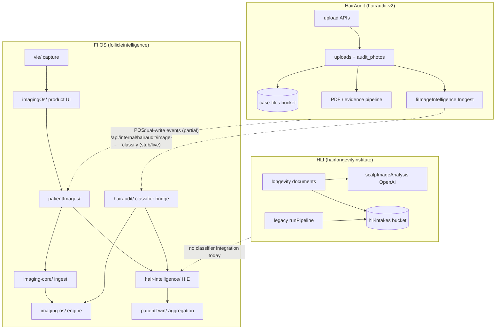

# FIN-IMAGING-1 — Unified Imaging Intelligence Architecture Audit

**Date:** 2026-07-02  
**Scope:** Ecosystem-wide imaging intelligence across FI OS, HairAudit, HLI  
**Mode:** Architecture audit + Phase 3 shared contracts (not published)  
**Repos:** `G:/follicleintelligence`, `G:/hairaudit-v2`, `G:/hairlongevityinstitute`

---

## Executive Summary

Imaging is the **largest duplication risk** in the Follicle Intelligence Network. Three products each run upload pipelines, local taxonomies, and (in two cases) independent OpenAI vision calls. FI OS already contains the most mature stack — HIE (`hair-intelligence/`), ImagingOS contracts, post-capture orchestration, and a HairAudit classifier bridge — but it is **split across two naming layers** (`imaging-os/` vs `imagingOs/`) and **two protocol systems** (ImagingOS vs HLI photo protocols).

**Brutally honest assessment:**

| Finding | Severity |
|---------|----------|
| HLI runs a **second OpenAI scalp classifier** unrelated to FI HIE | High |
| HairAudit FI classifier is **scaffolded end-to-end but live model returns null** | High |
| FI OS has **~6 OpenAI vision engines** plus stub/heuristic layers | Medium (intentional depth, but fragmented) |
| **8+ photo category taxonomies** across products with partial alias mapping | High |
| Storage is already correctly **local per product** — do not change | Low risk |
| `@follicle/intelligence-core` had **zero imaging contracts** until FIN-IMAGING-1 | Fixed in Phase 3 |

**Recommended direction:** FI OS HIE becomes **classifier authority**. Products keep images locally; only intelligence centralizes via signed internal API. No UI redesign. No pipeline removal in this phase.

---

## Table of Contents

1. [Imaging Architecture Map](#1-imaging-architecture-map)
2. [Image Processing Pipeline Map](#2-image-processing-pipeline-map)
3. [Storage Inventory](#3-storage-inventory)
4. [AI Classifier Inventory](#4-ai-classifier-inventory)
5. [Duplicated Code Inventory](#5-duplicated-code-inventory)
6. [Classifier Comparison Matrix](#6-classifier-comparison-matrix)
7. [Shared Contract Proposal (Phase 3)](#7-shared-contract-proposal-phase-3)
8. [FI OS Classifier Service Architecture (Phase 4)](#8-fi-os-classifier-service-architecture-phase-4)
9. [Storage Architecture Decision (Phase 5)](#9-storage-architecture-decision-phase-5)
10. [HLI Migration Plan (Phase 6)](#10-hli-migration-plan-phase-6)
11. [HairAudit Migration Plan (Phase 7)](#11-hairaudit-migration-plan-phase-7)
12. [Security Architecture (Phase 8)](#12-security-architecture-phase-8)
13. [Recommended Implementation Phases](#13-recommended-implementation-phases)
14. [Risk Table](#14-risk-table)
15. [FIN-IMAGING-2 Implementation Plan](#15-fin-imaging-2-implementation-plan)

---

## 1. Imaging Architecture Map



### FI OS — subsystem map

| Layer | Path | Role |
|-------|------|------|
| **Storage foundation** | `src/lib/patientImages/` | Supabase `patient-images` bucket, signed URLs, post-capture pipeline |
| **Unified ingest** | `src/lib/imaging-core/` | Metadata envelope, guided capture source resolution |
| **Intelligence engine** | `src/lib/imaging-os/` (~122 files) | IM-1–12 contracts: quality, protocol, classification stubs, progression, surgical, outcomes |
| **Product layer** | `src/lib/imagingOs/` (9 files) | FI admin workspace, guided capture sessions, scalp maps, annotations |
| **HIE (classifier authority candidate)** | `src/lib/hair-intelligence/` (~118 files) | OpenAI vision: image classify, hair loss, donor, recipient, progression, photo protocols |
| **VIE** | `src/lib/vie/` | Guided capture quality gate, longitudinal comparison, alignment (heuristic, not full vision) |
| **HairAudit bridge** | `src/lib/hairaudit/` | Internal classify endpoint service + response mapping |
| **Legacy shim** | `src/lib/imaging/` | Re-exports HIE classifiers |
| **Twin aggregation** | `src/lib/patientTwin/` | Surfaces HIE signals in patient twin cards |
| **Cross-product sync** | `src/lib/fi/foundation/*PatientImageDualWrite*` | HairAudit / HLI / IIOHR → FI event ingestion |

**Key tables:** `fi_patient_images`, `hli_image_classifications`, `fi_imaging_protocol_*`, `hli_photo_protocol_*`, `hair_intelligence_*`, `fi_vie_*`

### HairAudit — subsystem map

| Layer | Path | Role |
|-------|------|------|
| **Upload registry** | `src/lib/hairaudit/uploadRouteRegistry.ts`, `uploadContract.ts` | Surfaces, actors, canonical categories |
| **Forensic uploads** | `src/app/api/uploads/*` | Patient, audit, clinic routes → `uploads` + `audit_photos` |
| **Surgery portal** | `src/app/api/surgery-upload/*`, `src/lib/surgeryUpload/` | Slot-based surgery evidence |
| **Evidence prep** | `src/lib/evidence/prepareCaseEvidence.ts` | Sharp-based manifest for AI audit |
| **FI intelligence queue** | `src/lib/hairaudit/fiImageIntelligence*.ts` | Inngest worker → classifier adapter |
| **Classifier adapter** | `fiImageClassifierAdapter.ts`, `fiOsImageClassifierClient.ts` | Provider switch: dry_run, manual_stub, fi_os, openai (unimplemented) |
| **PDF / reports** | `src/lib/pdf/*`, `src/lib/reports/*` | Playwright + Sharp image embed |
| **Local heuristics** | `src/lib/photos/classification.ts` | Category inference without AI |

**Key tables:** `uploads`, `audit_photos`, `case_evidence_manifests`, `fi_image_intelligence_processed_jobs`, `surgery_upload_*`

### HLI — subsystem map

| Stack | Path | Role |
|-------|------|------|
| **Longevity (modern)** | `lib/longevity/*`, `lib/ai/openaiVisionProvider.ts` | Scalp upload → OpenAI structured analysis → clinician review |
| **Legacy Follicle Intelligence** | `lib/pipeline/runPipeline.ts`, `lib/ai/extractImages.ts` | Intake upload → stub/heuristic image proxies → scoring → PDF |
| **Blood extraction** | `lib/ai/extractBlood.ts`, `pdfExtractor.ts`, `imageOcrExtractor.ts` | PDF/OCR — **not vision classification**; stays HLI-local |
| **Progression** | `lib/longevity/scalpImageComparison.ts`, `caseComparison.ts` | Deterministic comparison on **confirmed** clinician findings |

**Key tables:** `hli_longevity_documents`, `hli_longevity_scalp_image_analysis_drafts`, `hli_longevity_scalp_image_comparisons`, legacy `hli_intakes` / `hli_ai_extractions`

---

## 2. Image Processing Pipeline Map

### FI OS — upload → intelligence

```
Upload API (staff / patient portal)
  → Supabase patient-images bucket
  → fi_patient_images row
  → patientImagePostCapturePipeline.server.ts
      ├─ classifyFiPatientImageAndPersist (HIE OpenAI → hli_image_classifications)
      ├─ runImagingQualityEvaluation (imaging-os/quality.ts)
      ├─ enqueueImagingAiAnalysisJob
      └─ visual summary auto-regen (if applicable)
  → Cron: /api/cron/fi-imaging-ai-analysis
      → clinicalImageAnalysisProvider.server.ts
          ├─ donor assess (conditional)
          ├─ recipient assess (conditional)
          └─ scalp region enforcement
```

### HairAudit — upload → evidence → optional FI classify

```
Upload API (patient / audit / clinic / surgery)
  → case-files bucket
  → uploads (+ audit_photos dual-write for audit-photos route)
  → uploadEventDispatcher → fiImageIntelligenceEnqueue (optional)
  → Inngest fi-image-intelligence-v1
      → fetch image from case-files
      → fiImageClassifierAdapter (default: dry_run)
      → fi_image_intelligence_processed_jobs + uploads.metadata writeback
Case submit
  → prepareCaseEvidence (Sharp) → case_evidence_manifests
  → AI audit pipeline (OpenAI text/vision for graft integrity — separate from FI classify)
PDF
  → elitePrintPhotoPipeline (Sharp) → Playwright print route
```

### HLI — longevity scalp path

```
POST /api/longevity/documents/upload (scalp_photo)
  → hli-intakes bucket (longevity/ prefix)
  → hli_longevity_documents (+ metadata.scalp_image after analysis)
Trichologist triggers scalp-image-analysis
  → Inngest hli-longevity-scalp-image-analysis-job
  → analyzeSingleScalpImage (OpenAI Vision, schema hli_longevity_scalp_image_analysis)
  → hli_longevity_scalp_image_analysis_drafts
Clinician apply
  → hli_longevity_scalp_image_comparisons
  → caseComparison / patientProgress / release
```

### HLI — legacy path (parallel, should not grow)

```
POST /api/intakes
  → hli-intakes bucket (intakes/ prefix)
  → runPipeline → extractImages (stub by default) → hli_ai_extractions
  → renderPremiumReport PDF
```

---

## 3. Storage Inventory

| Product | Bucket | Env / default | Path conventions | Created in |
|---------|--------|---------------|------------------|------------|
| **FI OS** | `patient-images` | `patientImagePolicy.ts` | `tenant/{tenantId}/patients/{patientId}/{imageId}-{filename}` | FI migration `20260613120001` |
| **HairAudit** | `case-files` | `CASE_FILES_BUCKET` | `cases/{caseId}/…`, `audit_photos/{caseId}/…`, `reports/…` | HairAudit migrations |
| **HairAudit** | `academy-assets` | — | Training isolated | Academy migration |
| **HLI** | `hli-intakes` | hardcoded | `longevity/{profileId}/…`, `intakes/{date}/…`, `reports/…` | SUPABASE_SETUP.md |

**Dual-write references:** FI OS dual-write cores reference HairAudit/HLI images in **`case-files`** and **`hli-intakes`** respectively — metadata sync only, not storage centralization.

**Derivatives (FI OS only):** watermarked/marketing variants via `sharp` in `patientImagePaths.ts`.

**Decision (Phase 5):** **Do not centralize image storage.** Classifier receives **time-limited signed URLs** only. Each product retains legal/clinical ownership of evidence.

---

## 4. AI Classifier Inventory

| Engine | Repo | Entry point | Model | Persists to | Maturity |
|--------|------|-------------|-------|-------------|----------|
| HIE image classification | FI OS | `openAiHairImageClassifier.server.ts` | `gpt-4o-mini` (env) | `hli_image_classifications`, `fi_patient_images.ai_*` | **Production-ready** |
| HIE hair loss | FI OS | `openAiHairLossClassifier.server.ts` | env | `hair_intelligence_hair_loss_classifications` | Production-ready |
| HIE donor assessment | FI OS | `openAiDonorAssessor.server.ts` | env | `hair_intelligence_donor_assessments` | Production-ready |
| HIE recipient candidacy | FI OS | `openAiRecipientAssessment.server.ts` | env | `hair_intelligence_recipient_candidacy_reviews` | Production-ready |
| HIE consultation checklist | FI OS | `openAiChecklistGenerator.server.ts` | env | `hair_intelligence_consultation_checklists` | Production-ready |
| HIE progression (rules) | FI OS | `progressionEngine.ts` | None (time series) | cohort buckets | Production-ready |
| ImagingOS stub pipeline | FI OS | `imaging-os/pipeline.ts` | None | In-memory | Contract only |
| Clinical analysis orchestrator | FI OS | `clinicalImageAnalysisProvider.server.ts` | Combines above | `fi_patient_images.metadata` | Production-ready |
| HairAudit internal endpoint | FI OS | `fiOsHairAuditImageClassifyService.ts` | Stub or HIE live | JSON response | **Bridge exists; live path partial** |
| VIE quality gate | FI OS | `vieQualityGate.ts` | Heuristic | `fi_vie_capture_intelligence` | Partial |
| HLI longevity scalp | HLI | `scalpImageAnalysis.ts` | `gpt-4.1-mini` (env) | drafts + document metadata | **Duplicate OpenAI stack** |
| HLI legacy extractImages | HLI | `extractImages.ts` | Stub / optional | `hli_ai_extractions` | Legacy, weak |
| HairAudit FI worker | HairAudit | `fiImageClassifierAdapter.ts` | Delegates to FI OS | `fi_image_intelligence_processed_jobs` | **Default dry_run** |
| HairAudit heuristics | HairAudit | `photos/classification.ts` | None | Used in evidence prep | Local only |
| HairAudit AI audit vision | HairAudit | AuditOS / graft integrity | OpenAI | Audit pipeline | **Forensic-specific — stays local** |

**OpenAI call count (vision):** FI OS ~5 distinct prompt engines; HLI ~1 distinct longevity engine + legacy stub; HairAudit **0 direct vision classify** (delegates or dry_run).

---

## 5. Duplicated Code Inventory

### Cross-repo duplication (highest priority)

| Concern | FI OS | HairAudit | HLI | Notes |
|---------|-------|-----------|-----|-------|
| **Anatomical view classification** | HIE `imageClassification/` | Adapter → FI (dormant) | `scalpImageAnalysis.ts` | **3 paths; 2 OpenAI implementations** |
| **Photo category taxonomy** | `imaging-os/categories.ts` (15 cats) | `patientPhotoCategoryConfig.ts` (40+) | `SCALP_DETECTED_VIEW` enum | Alias mapping partial in FI only |
| **Quality / blur detection** | `imaging-os/quality.ts`, HIE notes | Sharp heuristics in evidence prep | OpenAI + `SCALP_QUALITY_FLAG` | No shared contract until Phase 3 |
| **Protocol compliance** | `fi_imaging_protocol_*` + `hli_photo_protocol_*` | Patient pathway keys, surgery slots | Adaptive upload guidance | **Two protocol DB schemas in FI alone** |
| **Progression analysis** | HIE progression + ImagingOS IM-5 | `followupTimelineFromPatientUploads.ts` | `scalpImageComparison.ts` | Different semantics (audit vs longevity) |
| **Donor / recipient analysis** | HIE donor + recipient engines | `hairaudit-intelligence/donorIntelligence.ts` (report layer) | None | HA report layer ≠ classifier |
| **Post-upload orchestration** | `patientImagePostCapturePipeline` | `uploadEventDispatcher` + Inngest | Inngest scalp job | Parallel patterns |
| **Signed URL → model** | `patientImagesServer.ts` | `fiImageIntelligenceImageFetch.ts` | longevity signed-url routes | Same pattern, 3 implementations |

### Within FI OS duplication

| Pair | Issue |
|------|-------|
| `imaging-os/` vs `imagingOs/` | Intentional split but naming collision risk |
| `fi_imaging_protocol_*` vs `hli_photo_protocol_*` | Two protocol systems |
| `ImagingGuidedCaptureWizard` vs `VieCaptureWizard` | Overlapping guided capture |
| `src/lib/imaging/` shim vs `hair-intelligence/` | Legacy re-export layer |
| ImagingOS IM-5 progression vs HIE progression | Different purposes, similar names |

### Intentionally local (not duplication to remove)

| Concern | Owner | Reason |
|---------|-------|--------|
| PDF report image embedding | HairAudit, FI OS visual summary | Product-specific layout |
| Blood PDF/OCR extraction | HLI | Document type, not hair photo classify |
| Forensic evidence manifest | HairAudit | Audit legal chain of custody |
| Graft integrity / AuditOS vision | HairAudit | Forensic AI — professional layer allowed |

---

## 6. Classifier Comparison Matrix

| Capability | FI OS HIE | HLI Scalp AI | HairAudit FI worker | HairAudit heuristics | VIE quality |
|------------|-----------|--------------|---------------------|----------------------|-------------|
| Anatomical view / category | ✅ OpenAI, hair-restoration tuned | ✅ OpenAI, longevity schema | ⚠️ Stub/dry_run default | ✅ Metadata only | ❌ |
| Surgery stage | ✅ | ❌ | ⚠️ Via FI stub mapping | Partial | ❌ |
| Hair state / shave state | ✅ | ❌ | ⚠️ | ❌ | ❌ |
| Quality score | ✅ (quality.ts + AI notes) | ✅ structured | ⚠️ | Sharp-based | ✅ heuristic |
| Blur detection | ✅ | ✅ quality_flags | ❌ | ❌ | ✅ |
| Orientation / view | ✅ categories | ✅ detected_view | ❌ | ❌ | ✅ alignment |
| Protocol compliance | ✅ dual protocol engines | Partial (adaptive guidance) | ⚠️ stub protocol_status | ✅ pathway gates | ✅ VIE gate |
| Donor assessment | ✅ dedicated engine | ❌ | ❌ | ❌ | ❌ |
| Recipient assessment | ✅ dedicated engine | ❌ | ❌ | ❌ | ❌ |
| Hair loss pattern (Norwood/Ludwig) | ✅ | Via pattern candidates | ❌ | ❌ | ❌ |
| Progression / comparison | ✅ rules + VIE | ✅ clinician-confirmed | Timeline heuristics | ❌ | ✅ pairs |
| Idempotency / job queue | ✅ | ✅ | ✅ | N/A | N/A |
| Cross-product HTTP API | ✅ HairAudit endpoint | ❌ | ✅ client exists | N/A | N/A |
| Persistence model | Ledger + denormalized | Draft → confirm workflow | Job table + metadata | uploads.type | VIE tables |
| Fallback without OpenAI | ✅ stub + pending review | ❌ fails closed on missing key | ✅ dry_run | ✅ always | ✅ heuristic |

### Recommendation: single classifier authority

**FI OS HIE** (`src/lib/hair-intelligence/` + `imaging-os/` orchestration) should become the **single classifier authority** because:

1. It already runs in production on every FI OS patient image upload.
2. It has the **broadest capability surface** (view, stage, donor, recipient, hair loss, progression inputs).
3. HairAudit bridge **already exists** at `/api/internal/hairaudit/image-classify`.
4. HLI longevity classifier is **narrower** (longevity scalp schema) and **clinician-review-centric** — better as a **consumer** of centralized classify + local confirmation workflow.
5. Rebuilding in HairAudit or HLI would **triple OpenAI prompt maintenance**.

**HLI-specific outputs** (severity bands, visible findings, evidence features for triage fusion) should be modeled as **downstream enrichments** or optional `classification_type` extensions — not a separate base classifier.

---

## 7. Shared Contract Proposal (Phase 3)

**Location:** `G:/follicleintelligence/packages/intelligence-core/contracts/`

**Status:** Implemented locally. **Not published** to npm / not consumed by HairAudit or HLI yet.

| Contract file | Purpose |
|---------------|---------|
| `photoCategoryV1.ts` | 14 canonical ecosystem categories |
| `imageClassificationResultV1.ts` | Wire format for classify responses |
| `imageCaptureProtocolV1.ts` | Protocol compliance definition |
| `normalizedImageSignalV1.ts` | Cross-system intelligence envelope |

**Mapping note:** FI OS `imaging-os/categories.ts` uses `left`/`right`/`temporal`/`top`/`vertex`/`other` — alias map required at adapter layer (already started in `categories.ts` EXTERNAL_CATEGORY_ALIASES). HairAudit `uploadContract.ts` canonical categories align closely. HLI `SCALP_DETECTED_VIEW` requires explicit mapping table in FIN-IMAGING-2.

**Next steps before publish:**

1. Add `@follicle/intelligence-core` dependency to HairAudit + HLI (file: or private registry).
2. Replace local duplicate category constants with imports + product-specific alias maps.
3. Add contract validation tests (zod or type guards) at API boundaries.
4. Extend `events/types.ts` with `fi.imaging.classified` event (optional).

---

## 8. FI OS Classifier Service Architecture (Phase 4)

### Target topology

```
                    FI OS
          /api/internal/imaging/classify
                    ▲
    ┌───────────────┼───────────────┐
    │               │               │
 HairAudit        HLI Portal    Future apps
 (local storage)  (local storage)
```

### Proposed endpoint evolution

| Today | Target (FIN-IMAGING-2+) |
|-------|-------------------------|
| `/api/internal/hairaudit/image-classify` | `/api/internal/imaging/classify` |
| Bearer token only | Bearer + HMAC headers (Phase 8) |
| HairAudit request shape | `NormalizedImageSignalV1` / classify request DTO |
| Stub + partial live | Live HIE primary; stub for rollback |

### Request flow

1. Consumer uploads image to **local bucket** (unchanged).
2. Consumer creates signed URL (short TTL, e.g. 60–300s).
3. Consumer POSTs classify request with: `source_system`, `subject_id`, `image_id`, `signed_image_url`, `expected_category?`, `protocol_ref?`, `idempotency_key`.
4. FI OS validates auth → downloads via signed URL → runs HIE classify (+ optional donor/recipient if requested).
5. FI OS returns `ImageClassificationResultV1[]` (one or more classification types).
6. Consumer persists locally; optional FI event emission.

### Internal modules (reuse, do not rebuild)

- `classifyHairRestorationImageWithOpenAi` — base view classification
- `clinicalImageAnalysisProvider.server.ts` — extended analysis orchestration
- `fiOsHairAuditImageClassifyService.ts` — generalize to multi-source
- `imaging-os/quality.ts`, `protocol.ts` — deterministic layers

### Explicit non-goals

- No public endpoint.
- No image bytes stored in FI beyond transient fetch for inference.
- No production routing until FIN-IMAGING-2 acceptance tests pass.

---

## 9. Storage Architecture Decision (Phase 5)

| Principle | Decision |
|-----------|----------|
| Image bytes | **Remain local** per product |
| Classifier input | **Signed URL only**, short TTL, server-to-server |
| Intelligence results | **Local copy** in each product DB + optional FI ledger for FI-native patients |
| Cross-product sync | **Metadata/events only** (existing dual-write pattern) |
| Central media CDN | **Reject** — legal, tenancy, and RLS boundaries differ |

**HairAudit** owns forensic chain of custody in `case-files`.  
**FI OS** owns clinical imaging library in `patient-images`.  
**HLI** owns longevity intake artifacts in `hli-intakes`.

---

## 10. HLI Migration Plan (Phase 6)

### Current state

- **Modern longevity stack** runs independent OpenAI Vision in `scalpImageAnalysis.ts` (~750 lines, structured schema `hli_longevity_scalp_image_analysis`).
- **Legacy stack** still reachable via `/api/intakes` and `runPipeline`.
- **No** `@follicle/intelligence-core` dependency.
- **No** calls to FI OS classifier endpoint.

### Target state

```
HLI upload (unchanged UI)
  → hli-intakes storage (unchanged)
  → POST FI OS /api/internal/imaging/classify
  → Map ImageClassificationResultV1 → existing draft shape
  → hli_longevity_scalp_image_analysis_drafts (unchanged table)
  → Clinician review workflow (unchanged)
```

### Migration steps (FIN-IMAGING-2 onward)

| Step | Action | Risk |
|------|--------|------|
| HLI-1 | Add `@follicle/intelligence-core` + FI classify client | Low |
| HLI-2 | Implement adapter: FI result → `scalpImageAnalysis` draft fields | Medium — field mapping |
| HLI-3 | Feature flag `HLI_CLASSIFIER_PROVIDER=fi_os\|legacy_openai` | Low |
| HLI-4 | Parallel run shadow mode: compare FI vs legacy on sample intakes | Medium |
| HLI-5 | Switch default to FI OS; keep legacy fallback 30 days | Medium |
| HLI-6 | Deprecate direct OpenAI calls in `analyzeSingleScalpImage` | Low after validation |
| HLI-7 | **Do not migrate** blood PDF/OCR — stays local | N/A |
| HLI-8 | **Do not migrate** `scalpImageComparison.ts` deterministic engine — stays local | N/A |
| HLI-9 | Freeze legacy `/api/intakes` image extraction — redirect to longevity path | High — confirm product sunset |

### Duplicated logic to remove (later phases, not FIN-IMAGING-1)

- `lib/ai/openaiVisionProvider.ts` scalp-specific prompts (after adapter proven)
- Overlapping view detection between `SCALP_DETECTED_VIEW` and HIE categories — replace with mapping from centralized classify

---

## 11. HairAudit Migration Plan (Phase 7)

### Remain local (permanent)

| System | Reason |
|--------|--------|
| Upload wizards (patient, doctor, surgery) | Product UX + legal consent flows |
| `case-files` storage + RLS | Forensic evidence custody |
| `audit_photos` dual-write | Evidence canonical rows |
| `prepareCaseEvidence` / manifests | Audit AI input packaging |
| PDF generation (Playwright, Sharp) | Report product |
| Graft integrity / AuditOS vision | Forensic professional AI |
| Surgery export packs | Operational deliverable |

### Move to FI classifier

| Capability | Current | Target |
|------------|---------|--------|
| Anatomical classification | dry_run / manual_stub | `fi_os` live |
| Protocol compliance scoring | Stub in classify response | FI `imaging-os/protocol.ts` |
| Quality / blur / orientation | Not in worker | FI quality + HIE notes |
| Donor quality estimation | Report-layer only | FI HIE donor engine (optional flag) |
| Recipient analysis | Report-layer only | FI HIE recipient engine (optional flag) |

### Migration steps

| Step | Action |
|------|--------|
| HA-1 | Set `HAIRAUDIT_FI_IMAGE_CLASSIFIER_PROVIDER=fi_os` in staging |
| HA-2 | Wire `classifyClinicalHairImageFromModelUrl` to HIE live (currently returns null) |
| HA-3 | Generalize FI endpoint from HairAudit-only to multi-source |
| HA-4 | Map classify results → `uploads.metadata.fi_classification` via existing writeback adapter |
| HA-5 | Align `uploadContract.ts` categories with `PhotoCategoryV1` + alias map |
| HA-6 | Keep `photos/classification.ts` as fallback when FI unavailable |
| HA-7 | Document that AuditOS vision calls are **out of scope** for centralization |

### Existing scaffold (ready to activate)

HairAudit already has:

- Inngest worker `fi-image-intelligence-v1`
- `fi_image_intelligence_processed_jobs` table
- `fiOsImageClassifierClient.ts` → FI OS HTTP
- FI OS endpoint with token auth

**Blocker:** `isClinicalHairImageClassifierAvailable()` returns false; live path incomplete.

---

## 12. Security Architecture (Phase 8)

### Current state

- FI OS `/api/internal/hairaudit/image-classify` uses **Bearer token** (`HAIRAUDIT_IMAGE_CLASSIFIER_TOKEN`).
- Timing-safe comparison; rejects service-role reuse.
- No timestamp replay protection.
- No `x-fi-source-system` header validation.

### Target model

**Headers (all required):**

| Header | Purpose |
|--------|---------|
| `Authorization: Bearer <token>` | Shared secret per source system (or per-consumer token) |
| `x-fi-imaging-timestamp` | ISO-8601 request time |
| `x-fi-imaging-signature` | HMAC-SHA256 of `{timestamp}\n{source_system}\n{body_hash}` |
| `x-fi-source-system` | `hairaudit` \| `hli` \| `iiohr` |

**Validation rules:**

1. Reject missing/invalid Bearer token.
2. Reject unknown `x-fi-source-system`.
3. Reject timestamps older than **5 minutes** (clock skew tolerant).
4. Reject signature mismatch (timing-safe).
5. Rate limit per source system + IP (FI OS edge).
6. **No public route** — internal network / mTLS optional for hardened deploy.

**Secrets:**

| Env (FI OS) | Consumer |
|-------------|----------|
| `FI_IMAGING_CLASSIFY_TOKEN_HAIRAUDIT` | HairAudit |
| `FI_IMAGING_CLASSIFY_TOKEN_HLI` | HLI |
| `FI_IMAGING_CLASSIFY_HMAC_SECRET` | Shared signing key |

Migrate from single `HAIRAUDIT_IMAGE_CLASSIFIER_TOKEN` without breaking existing HairAudit staging.

---

## 13. Recommended Implementation Phases

| Phase | ID | Scope | Products |
|-------|-----|-------|----------|
| ✅ Audit + contracts | FIN-IMAGING-1 | This document + intelligence-core contracts | All |
| Classifier service hardening | FIN-IMAGING-2 | Live HIE behind unified endpoint, security headers | FI OS + HA staging |
| HairAudit activation | FIN-IMAGING-3 | Enable fi_os provider, metadata writeback | HairAudit |
| HLI consumer migration | FIN-IMAGING-4 | Replace longevity OpenAI with FI classify | HLI |
| Protocol unification | FIN-IMAGING-5 | Merge dual FI protocol systems; shared `ImageCaptureProtocolV1` | FI OS |
| Category alias consolidation | FIN-IMAGING-6 | Single alias registry in intelligence-core | All |
| Shadow intelligence alignment | FIN-IMAGING-7 | AuditOS reads FI classify metadata | HairAudit |
| Legacy deprecation | FIN-IMAGING-8 | HLI legacy pipeline, HA openai provider stub removal | HLI, HA |
| VIE + ImagingOS convergence | FIN-IMAGING-9 | Reduce guided capture duplication | FI OS |

---

## 14. Risk Table

| Risk | Likelihood | Impact | Mitigation |
|------|------------|--------|------------|
| Breaking existing uploads during classify migration | Medium | Critical | No storage changes; feature flags; dry_run default |
| HLI clinician workflow regression | Medium | High | Parallel shadow compare; drafts schema unchanged |
| Category mapping errors (audit evidence scoring) | High | High | Alias table tests; manual_stub fallback |
| OpenAI cost spike when enabling live classify on all HA uploads | Medium | Medium | Eligibility gates (existing `fiImageIntelligenceBridge`); batch limits |
| Latency on upload path if classify synchronous | Medium | Medium | Keep async Inngest; never block upload response |
| Security token leakage | Low | Critical | Per-consumer tokens + HMAC; short signed URLs |
| FI OS single point of failure | Medium | High | Stub fallback in consumers; circuit breaker in client |
| Norwood/donor prompts diverge from HLI longevity semantics | Medium | Medium | Separate `classification_type`; optional enrichments |
| Two FI protocol systems confuse compliance | High | Medium | FIN-IMAGING-5 dedicated phase |
| Premature code deletion | Medium | High | **Explicit ban until FIN-IMAGING-8** |

---

## 15. FIN-IMAGING-2 Implementation Plan

**Goal:** Make FI OS the live classifier authority for HairAudit staging, with unified endpoint and security scaffold — **without** HLI migration or production cutover.

### FIN-IMAGING-2 deliverables

#### 2A — Unified classify endpoint (FI OS)

- [ ] Add `POST /api/internal/imaging/classify` route
- [ ] Accept multi-source requests (`hairaudit`, `hli` shape compatible)
- [ ] Delegate to `classifyHairRestorationImageWithOpenAi` + quality/protocol layers
- [ ] Return `ImageClassificationResultV1[]` JSON
- [ ] Keep `/api/internal/hairaudit/image-classify` as deprecated alias (6-month sunset)

#### 2B — Live classifier activation

- [ ] Fix `classifyClinicalHairImageFromModelUrl.server.ts` to call HIE (remove null return)
- [ ] Wire signed URL fetch from consumer-provided storage coordinates
- [ ] Implement `HAIRAUDIT_IMAGE_CLASSIFIER_MODE=live` end-to-end test

#### 2C — Security Phase 1

- [ ] Add optional HMAC validation middleware (feature-flagged `FI_IMAGING_REQUIRE_HMAC`)
- [ ] Per-consumer token env vars
- [ ] Timestamp skew rejection (5 min)
- [ ] Audit log: source_system, image_id, latency, model version (no URLs in logs)

#### 2D — HairAudit staging activation

- [ ] Staging env: `HAIRAUDIT_FI_IMAGE_CLASSIFIER_PROVIDER=fi_os`
- [ ] Configure `FI_OS_IMAGE_CLASSIFIER_URL` → unified endpoint
- [ ] Verify writeback to `uploads.metadata` + `fi_image_intelligence_processed_jobs`
- [ ] Add integration test: upload → Inngest → classify → metadata

#### 2E — Contract adoption (FI OS only)

- [ ] Map HIE output → `ImageClassificationResultV1` in classify response builder
- [ ] Map `PhotoCategoryV1` ↔ `imaging-os/categories.ts` in adapter
- [ ] Unit tests for alias round-trips (HairAudit `preop_front` → `front`)

#### 2F — Observability

- [ ] Metrics: classify latency, OpenAI error rate, stub fallback rate
- [ ] Alert: production stub mode warning (already exists for HairAudit endpoint)

### FIN-IMAGING-2 explicit exclusions

- ❌ HLI code changes
- ❌ Delete duplicate classifiers
- ❌ Centralize storage
- ❌ UI changes
- ❌ Production HairAudit cutover (staging only)
- ❌ npm publish of intelligence-core

### FIN-IMAGING-2 acceptance criteria

1. HairAudit staging upload triggers live FI classification for eligible images.
2. Classify response validates against `ImageClassificationResultV1`.
3. Upload APIs unchanged; no user-visible regression.
4. Legacy HairAudit endpoint still works (backward compat).
5. Security headers enforced when flag enabled.
6. Documented runbook for rollback to `dry_run`.

### Estimated effort

| Workstream | Days |
|------------|------|
| Unified endpoint + HIE live wiring | 3–4 |
| Security middleware | 1–2 |
| HairAudit staging + tests | 2–3 |
| Contract mapping + tests | 1–2 |
| **Total** | **7–11 dev days** |

---

## Appendix A — File index (quick reference)

### FI OS (top paths)

- `src/lib/imaging-os/` — intelligence engine
- `src/lib/imagingOs/` — product layer
- `src/lib/hair-intelligence/` — HIE OpenAI engines
- `src/lib/patientImages/patientImagePostCapturePipeline.server.ts` — orchestration hub
- `app/api/internal/hairaudit/image-classify/route.ts` — current bridge
- `packages/intelligence-core/contracts/*V1.ts` — shared contracts (Phase 3)

### HairAudit

- `src/lib/hairaudit/fiImageClassifierAdapter.ts`
- `src/lib/hairaudit/uploadContract.ts`
- `src/lib/patientPhotoCategoryConfig.ts`
- `src/lib/evidence/prepareCaseEvidence.ts`
- `src/app/api/uploads/audit-photos/route.ts`

### HLI

- `lib/longevity/scalpImageAnalysis.ts`
- `lib/ai/openaiVisionProvider.ts`
- `lib/longevity/scalpImageComparison.ts`
- `lib/pipeline/runPipeline.ts` (legacy)

---

## Appendix B — Phase 9 compliance

This audit phase **did not**:

- Delete duplicate code
- Migrate image storage
- Redesign UI
- Remove existing pipelines
- Enable production routing
- Remove local upload flows

Phase 3 contracts were added to `@follicle/intelligence-core` locally and are **not published**.
