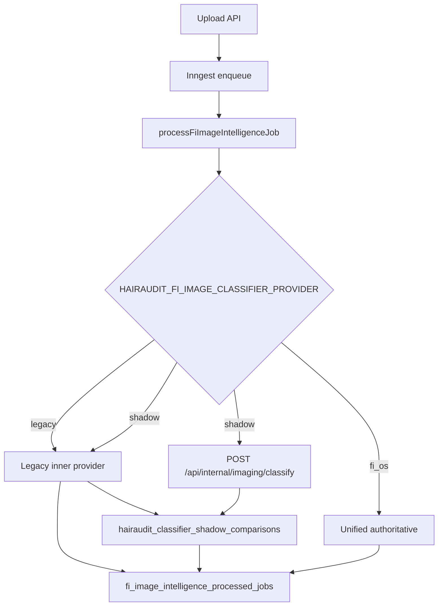

# FIN-IMAGING-3 — HairAudit Staging Cutover to Unified Classifier

**Status:** Implemented (staging only — no production cutover)  
**Repos:** `hairaudit-v2`, `follicleintelligence`  
**Depends on:** FIN-IMAGING-2 (`POST /api/internal/imaging/classify`)

---

## Summary

HairAudit staging can now route image classification through the FI OS unified classifier while preserving instant rollback to the legacy path. Shadow mode runs both classifiers, logs differences, and keeps the legacy result authoritative.

---

## Phase 1 — Current Classifier Flow Map

### Production path (default)

```text
Upload API (patient / audit / clinic / surgery)
  → notifyHairAuditUploadCreated()
  → enqueueFiImageIntelligenceFromUploadEvent() [when HAIRAUDIT_FI_IMAGE_INTELLIGENCE_ENABLED=true]
  → Inngest: hairaudit/fi.image-intelligence.enqueue
  → processFiImageIntelligenceJob()
  → classifyHairAuditImage() [legacy inner provider: dry_run | manual_stub | fi_os_legacy]
  → fi_image_intelligence_processed_jobs
  → classifier metadata write-back → uploads.metadata

Report pipeline (parallel, always-on heuristics):
  runAudit → prepareCaseEvidenceManifest() → inferCanonicalPhotoCategory()
  → attachHairAuditIntelligenceToReportSummarySafeWithClassifier()
  → PDF (elitePrintPhotoPipeline groups by heuristic category)
```

### Classification entry points

| Entry | File | Notes |
|-------|------|-------|
| Upload APIs | `src/app/api/uploads/*`, `surgery-upload/photos` | Enqueue only; no sync classify |
| Inngest worker | `src/lib/inngest/functions/fiImageIntelligenceWorker.ts` | Primary async classify |
| Internal receive (HairAudit-hosted) | `src/app/api/internal/hairaudit/image-classify` | Legacy FI contract receiver |
| Report intelligence | `src/lib/hairaudit-intelligence/shadow/inngestHairAuditIntelligence.server.ts` | Consumes persisted classifier results |
| Evidence manifest | `src/lib/evidence/prepareCaseEvidence.ts` | Heuristic categories (not FI worker) |
| PDF | `src/lib/pdf/elitePrintPhotoPipeline.ts` | Heuristic grouping |

---

## Phase 2 — Unified Endpoint Adapter

**File:** `src/lib/integrations/fiOsUnifiedImageClassifier.ts`

Calls FI OS:

```http
POST /api/internal/imaging/classify
Authorization: Bearer ${FI_OS_IMAGE_CLASSIFIER_TOKEN}
x-fi-source-system: hairaudit
x-fi-imaging-timestamp: <ISO-8601 when HMAC enabled>
x-fi-imaging-signature: <HMAC-SHA256 hex of {timestamp}.{rawBody} when HMAC enabled>
```

Optional HMAC signing (client-side):

| Env | Default | Behavior |
|-----|---------|----------|
| `FI_OS_IMAGE_CLASSIFIER_HMAC_SECRET` | unset | Shared secret with FI OS `FI_IMAGING_CLASSIFY_HMAC_SECRET` |
| `FI_OS_IMAGE_CLASSIFIER_REQUIRE_HMAC` | `false` | When `true`, fail closed if secret missing; when secret set, always sign |

Signing rules:

- Bearer token always sent when configured (unchanged).
- Sign only when `FI_OS_IMAGE_CLASSIFIER_HMAC_SECRET` is set, or when `FI_OS_IMAGE_CLASSIFIER_REQUIRE_HMAC=true` (which requires the secret).
- Signature material: `{x-fi-imaging-timestamp}.{raw JSON body}` → HMAC-SHA256 hex digest.
- Without secret and `REQUIRE_HMAC=false`, requests remain bearer-only (backward compatible).

Request fields:

- `source_system=hairaudit`
- `source_image_id` (upload id)
- `case_id`, optional `patient_id`
- `storage_bucket` + `storage_path` or `signed_url` / `image_url`
- `capture_source`, `upload_source`
- `canonical_photo_category`, `legacy_upload_type`
- `metadata.idempotency_key`

Response mapped from `ImageClassificationResultV1` → `FiImageIntelligenceResult` (`classification_source: fi_os_unified`).

**Legacy route preserved:** `src/lib/hairaudit/fiOsImageClassifierClient.ts` → `/api/internal/hairaudit/image-classify` (`fi_os_legacy` inner provider).

---

## Phase 3 — Shadow Mode

When `HAIRAUDIT_FI_IMAGE_CLASSIFIER_PROVIDER=shadow`:

1. Run legacy inner classifier (authoritative)
2. Run unified FI classifier silently
3. Compare and persist to `hairaudit_classifier_shadow_comparisons`
4. Return legacy result only (no patient-visible change)

**Comparison fields:** category match, confidence/quality/blur/protocol deltas, latency, fallback_used, provider, processing_version.

**Migration:** `supabase/migrations/20260702170000_hairaudit_classifier_shadow_comparisons.sql`  
**RLS:** service_role only — not exposed publicly.

---

## Phase 4 — Feature Flag

| Env | Values | Default | Behavior |
|-----|--------|---------|----------|
| `HAIRAUDIT_FI_IMAGE_CLASSIFIER_PROVIDER` | `legacy`, `shadow`, `fi_os`, `dry_run`, `manual_stub`, `openai` | implicit `legacy` + `dry_run` | Cutover mode when `legacy`/`shadow`/`fi_os`; inner legacy provider when `dry_run`/`manual_stub`/`openai` |
| `HAIRAUDIT_FI_IMAGE_CLASSIFIER_LEGACY_PROVIDER` | `dry_run`, `manual_stub`, `fi_os_legacy`, `openai` | `dry_run` | Explicit legacy inner provider override |
| `FI_OS_IMAGE_CLASSIFIER_URL` | unified endpoint URL | — | Staging: `https://<fi-host>/api/internal/imaging/classify` |
| `FI_OS_IMAGE_CLASSIFIER_TOKEN` | bearer token | — | Matches `FI_INTERNAL_IMAGING_CLASSIFIER_TOKEN` on FI OS |
| `FI_OS_IMAGE_CLASSIFIER_HMAC_SECRET` | HMAC signing key | unset | Optional; must match FI OS `FI_IMAGING_CLASSIFY_HMAC_SECRET` |
| `FI_OS_IMAGE_CLASSIFIER_REQUIRE_HMAC` | require signed requests | `false` | Fail closed locally if `true` and secret missing |

| Mode | Authoritative result | Unified call |
|------|---------------------|--------------|
| `legacy` (default) | Legacy inner provider only | No |
| `shadow` | Legacy inner provider | Yes — compare + log |
| `fi_os` | Unified classifier | Yes |

**Production default unchanged:** unset env → legacy + dry_run.

---

## Phase 5 — Report / PDF Safety

No report logic rewrites in this phase.

- Evidence manifests continue using `inferCanonicalPhotoCategory()` heuristics.
- PDF grouping unchanged (`elitePrintPhotoPipeline.ts`).
- Classifier enrichment remains optional via intelligence shadow attach.
- Unified/legacy results map into existing `FiImageIntelligenceResult` — no PDF schema changes.

---

## Phase 6 — Observability

Structured logs via `[hairaudit:fi-classifier-cutover]`:

- `shadow_comparison` events with source_system, upload_id, category match, deltas, latency, fallback_used
- `cutover_event` for fi_os authoritative runs

Alert-worthy (log-based):

- Category mismatch rate under threshold (staging review)
- `unified_fallback_used` spike
- Repeated `unified_failed` outcomes
- Null classifications

---

## Phase 7 — Staging Validation Suite

Recommended staging mix (20 uploads):

| Journey | Count | Upload route |
|---------|-------|--------------|
| Patient wizard | 10 | `/api/uploads/audit-photos` |
| Doctor | 5 | `/api/uploads/audit-photos` |
| Surgery portal | 5 | `/api/surgery-upload/photos` |

**Staging env:**

```env
HAIRAUDIT_FI_IMAGE_INTELLIGENCE_ENABLED=true
HAIRAUDIT_FI_IMAGE_INTELLIGENCE_WORKER_ENABLED=true
HAIRAUDIT_FI_IMAGE_CLASSIFIER_PROVIDER=shadow
HAIRAUDIT_FI_IMAGE_CLASSIFIER_LEGACY_PROVIDER=manual_stub
FI_OS_IMAGE_CLASSIFIER_URL=https://<staging-fi>/api/internal/imaging/classify
FI_OS_IMAGE_CLASSIFIER_TOKEN=<token>
# Optional HMAC (enable when FI OS staging requires signed requests):
# FI_OS_IMAGE_CLASSIFIER_HMAC_SECRET=<shared-hmac-secret>
# FI_OS_IMAGE_CLASSIFIER_REQUIRE_HMAC=false
```

**Measure after uploads:**

```sql
SELECT
  COUNT(*) AS comparisons,
  AVG(CASE WHEN categories_match THEN 1.0 ELSE 0.0 END) AS category_match_rate,
  AVG(latency_ms) AS avg_unified_latency_ms,
  AVG(CASE WHEN unified_fallback_used THEN 1.0 ELSE 0.0 END) AS fallback_rate
FROM hairaudit_classifier_shadow_comparisons
WHERE created_at > NOW() - INTERVAL '24 hours';
```

Local/unit coverage: `pnpm test:fin-imaging-3`

---

## Phase 8 — Rollback

Instant rollback — no migrations block reversal:

```env
HAIRAUDIT_FI_IMAGE_CLASSIFIER_PROVIDER=legacy
# or unset (same effect with dry_run inner default)
```

Legacy classifier code untouched. No deletions.

---

## Phase 9 — Tests

```bash
pnpm typecheck
pnpm test:fin-imaging-3
pnpm test:upload-phase3d
pnpm test:upload-phase3e
pnpm test:upload-phase3f
```

**File:** `tests/fiOsUnifiedImageClassifierCutover.test.ts`

- Adapter request/response mapping
- Optional HMAC signing headers and fail-closed require flag
- Cutover modes: legacy, shadow, fi_os
- Shadow comparison record shape
- Env resolution backward compatibility

---

## Production Cutover Checklist (FIN-IMAGING-4 — not in scope)

- [ ] Shadow match rate ≥ agreed threshold (e.g. 95% category match)
- [ ] Fallback rate ≤ agreed threshold
- [ ] PDF spot-check on 20+ staging reports
- [ ] Observability dashboards wired
- [ ] On-call runbook for rollback
- [ ] Promote `HAIRAUDIT_FI_IMAGE_CLASSIFIER_PROVIDER=fi_os` in production with governance sign-off

---

## Architecture Diagram



---

## Suggested Commit Message

```
feat(imaging): add HairAudit staging cutover to unified classifier

FIN-IMAGING-3: unified FI adapter, shadow compare table, legacy/shadow/fi_os
cutover modes, observability, and staging rollback safety. No production
cutover or legacy code removal.
```
