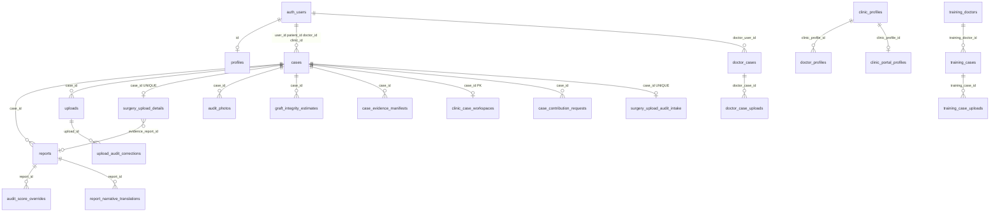
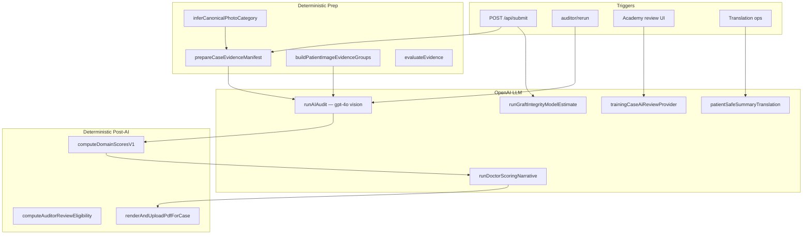
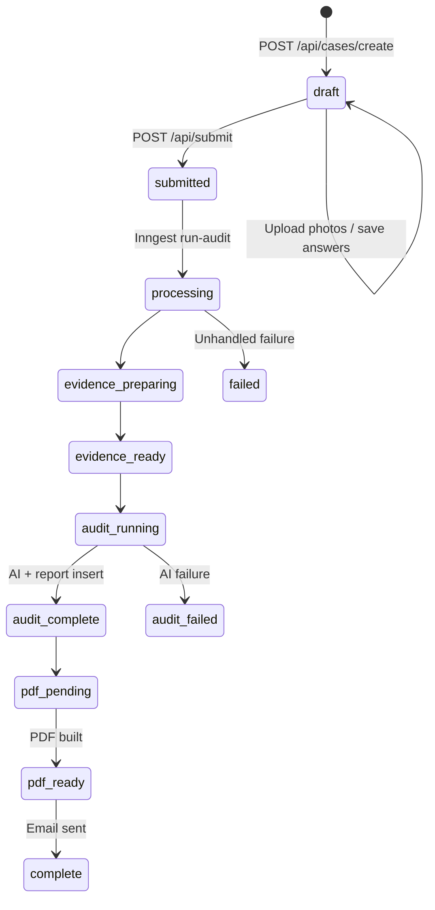

# HairAudit Ecosystem Convergence Audit

**Date:** 2026-06-17  
**Scope:** Full architectural audit of `hairaudit-v2` for migration alignment with the Follicle Intelligence (FI) OS ecosystem  
**Mode:** Read-only audit — no code changes  

---

## Executive Summary

HairAudit is a **Next.js App Router monolith** (171 pages, ~224 components, ~120 API routes, 64 Supabase migrations) that combines public marketing, role-based dashboards, forensic audit workflows, clinic/doctor transparency, surgery upload staging, IIOHR Academy training, and community ratings. Data lives in **Supabase Postgres + Storage**; async orchestration uses **Inngest**; AI uses **OpenAI only**; PDFs use **Playwright**.

The codebase is already **partially aligned** with the FI ecosystem via vendored `packages/fi-network-ui`, optional AuditOS shadow snapshots, normalized event emission hooks, and nullable `external_*` ID columns. Core audit logic, scoring, and report ownership remain **HairAudit-local**.

**Critical findings for convergence planning:**

| Area | Assessment |
|------|------------|
| Database | Six parallel domain models on one Postgres instance; core `cases`/`reports`/`uploads` lack RLS |
| Upload | Seven upload APIs, two storage path conventions, no stored thumbnails |
| AI | Single vendor (OpenAI); hybrid deterministic + LLM scoring; classification split between heuristics and vision |
| Workflow | Two independent audit worlds: forensic pipeline vs surgery-upload staging |
| Frontend | Dual public design systems; FI shell on homepage, legacy dark chrome elsewhere |
| Security | App-layer gates generally sound; several unauthenticated debug APIs and role-escalation gaps |
| FI alignment | AuditOS read models exist; production still runs legacy pipeline end-to-end |

---

## Table of Contents

1. [Current Architecture](#1-current-architecture)
   - [1.1 System Topology](#11-system-topology)
   - [1.2 Database Architecture](#12-database-architecture)
   - [1.3 Upload Pipeline](#13-upload-pipeline)
   - [1.4 AI Systems](#14-ai-systems)
   - [1.5 Audit Workflow Engine](#15-audit-workflow-engine)
   - [1.6 Frontend Architecture](#16-frontend-architecture)
   - [1.7 Security Architecture](#17-security-architecture)
2. [Legacy Systems](#2-legacy-systems)
3. [Migration Opportunities (FI OS Comparison)](#3-migration-opportunities-fi-os-comparison)
4. [Technical Debt](#4-technical-debt)
5. [Phased Rebuild Plan](#5-phased-rebuild-plan)

---

## 1. Current Architecture

### 1.1 System Topology

```text
┌─────────────────────────────────────────────────────────────────────────┐
│                         HairAudit (Next.js Monolith)                     │
├─────────────────────────────────────────────────────────────────────────┤
│  Public Marketing │ Dashboards │ Cases │ Academy │ Admin │ Community   │
├─────────────────────────────────────────────────────────────────────────┤
│                    API Layer (src/app/api/**)                            │
│   Auth via session │ Service role for DB │ App-layer access control     │
├─────────────────────────────────────────────────────────────────────────┤
│  Inngest Jobs: run-audit │ GII estimate │ PDF rebuild │ auditor-rerun   │
│                surgery evidence PDF │ contribution reminders │ backfill  │
├─────────────────────────────────────────────────────────────────────────┤
│  Supabase: Postgres (58+ tables) │ Storage (case-files bucket) │ Auth  │
├─────────────────────────────────────────────────────────────────────────┤
│  External: OpenAI │ Inngest │ Playwright │ Resend │ (optional FI events)│
└─────────────────────────────────────────────────────────────────────────┘
```

**Core production path:**

1. Case created → answers + photos collected
2. `POST /api/submit` → Inngest `case/submitted`
3. Evidence prep → AI audit → domain scoring → report insert → PDF
4. Parallel GII estimate → auditor review for extremes
5. Email + download delivery

**Reference docs in repo:** `docs/architecture-map.md`, `docs/FUTURE-INTEGRATION-ARCHITECTURE.md`, `docs/auditos-stage4a-pipeline-map.md`

---

### 1.2 Database Architecture

#### 1.2.1 Platform & Schema Management

| Attribute | Value |
|-----------|-------|
| Database | Supabase Postgres |
| Migrations | 64 files in `supabase/migrations/` |
| ORM | None — raw Supabase client |
| Generated types | **Not committed** — schema knowledge in migrations + app usage |
| Baseline DDL | **`cases`, `reports`, `uploads` CREATE TABLE not in repo** — predate migrations |

#### 1.2.2 Domain Model Overview

HairAudit Postgres spans **six major domains** on a single database:

| Domain | Primary Tables | Purpose |
|--------|----------------|---------|
| **Forensic audit** | `cases`, `reports`, `uploads`, `audit_photos`, `case_evidence_manifests`, `graft_integrity_estimates`, `audit_score_overrides`, `audit_rerun_log` | Patient/doctor/clinic audit pipeline |
| **Clinic/doctor transparency** | `clinic_profiles`, `doctor_profiles`, `case_contribution_requests`, `clinic_award_history`, `doctor_award_history`, `clinic_portal_profiles`, `clinic_case_workspaces` | Benchmarking, awards, contribution workflow |
| **Doctor portal v2** | `doctor_cases`, `doctor_case_uploads`, `doctor_default_surgical_profiles`, `doctor_report_visibility`, `doctor_training_enrollments` | Separate doctor-owned case model |
| **Surgery upload portal** | `surgery_upload_details`, `surgery_upload_slot_reviews`, `surgery_upload_evidence_events`, `surgery_upload_audit_intake`, `surgery_upload_photo_exports`, `surgery_upload_clinic_defaults` | Mobile pre-audit evidence collection |
| **IIOHR Academy** | ~25 `training_*` / `academy_*` tables | Surgical training, competency ladders, faculty reviews |
| **Community** | `community_cases`, `community_case_ratings` | Rate My Hair Transplant feature |

#### 1.2.3 User & Identity Tables

| Table | Role | Key Columns |
|-------|------|-------------|
| `auth.users` | Supabase auth (external) | Standard Supabase auth |
| `profiles` | App role + display | `id` → `auth.users`, `role` (patient/doctor/clinic/auditor), `preferred_language` |
| `academy_users` | Academy roles (isolated) | Separate from `profiles.role` |

**Patient entity model:** No dedicated `patients` table. Patients are `auth.users` + `profiles.role = 'patient'` + `cases.patient_id` / `cases.user_id`.

**Dual identity pattern (important):**

- `cases.clinic_id` / `cases.doctor_id` → `auth.users`
- `clinic_profiles.linked_user_id` / `doctor_profiles.linked_user_id` → `auth.users`
- `doctor_profiles.clinic_profile_id` → `clinic_profiles`
- **No FK** between `cases` and profile tables — linkage is logical via user IDs and app code

#### 1.2.4 Case Tables

| Table | Scope | Status Enum |
|-------|-------|-------------|
| `cases` | Main forensic audit shell | App-enforced (20+ values, no DB CHECK) |
| `doctor_cases` | Doctor portal v2 | Postgres ENUM `doctor_case_status` |
| `training_cases` | Academy | `draft`, `in_review`, `reviewed`, `archived`, `voided` |
| `community_cases` | Public ratings | Minimal schema |
| `surgery_upload_details` | 1:1 extension of `cases` | Multiple parallel status columns |

**`cases` key columns (migration-added):**

- Participants: `patient_id`, `doctor_id`, `clinic_id`, `audit_type`, `audit_mode`, `visibility_scope`, `submission_channel`
- Auditor lifecycle: `assigned_auditor_id`, `auditor_started_at`, `archived_at`, `deleted_at`
- Evidence scoring: `evidence_score_doctor/patient`, `confidence_label_*`, `evidence_details`
- Pipeline: `rerun_count`, `processing_log`, `is_test`
- Integration: `external_case_id`, `batch_id` (bulk intake)
- Bulk intake: `case_label`, `patient_reference`, `graft_count`, `intake_status`

#### 1.2.5 Photo / Image Tables

| Table | Storage | Metadata |
|-------|---------|----------|
| `uploads` | `storage_path` → Supabase `case-files` bucket | `type` (e.g. `patient_photo:*`, `surgery_photo:*`), `metadata` JSONB |
| `audit_photos` | Canonical evidence paths (`audit_photos/{caseId}/…`) | `photo_key`, `submitter_type`, `public_url` |
| `case_evidence_manifests` | Prepared derivatives at `cases/{caseId}/prepared/*.jpg` | `prepared_images`, `quality_score`, `missing_categories` |
| `hair_audit_case_images` | Bulk staging (`cases/bulk/…`) | Pre-sync to `uploads` |
| `training_case_uploads` | Academy paths (`academy/training-cases/…`) | `type`, `metadata_json` |
| `doctor_case_uploads` | Doctor portal v2 | Not wired to main upload APIs |
| `upload_audit_corrections` | Auditor photo corrections | → `uploads` (no FK on `case_id`) |

#### 1.2.6 Audit Report Tables

| Table | Purpose |
|-------|---------|
| `reports` | Versioned audit reports; monolithic `summary` JSONB |
| `audit_score_overrides` | Per-domain manual auditor scores |
| `audit_section_feedback` | Section notes with visibility scope |
| `audit_score_override_history` | Change audit trail |
| `report_narrative_translations` | i18n patient-safe summary pilot |
| `hairaudit_auditos_shadow_snapshots` | AuditOS diagnostic snapshots (FI convergence) |
| `graft_integrity_estimates` | GII AI + auditor review |
| `audit_rerun_log` | Rerun actions and status |

**`reports` key columns:**

- Pipeline: `status`, `error`, `report_kind` (NULL = forensic; `surgery_upload_evidence_review_v1` = surgery PDF)
- Auditor review: `auditor_review_eligibility`, `auditor_review_status`, `auditor_review_reason`
- Awards: `provisional_status`, `counts_for_awards`, `validation_method`, `award_contribution_weight`
- Integration: `external_document_id`, `report_ready_email_sent_at`

#### 1.2.7 Clinic / Doctor / Patient Entities

| Entity | Table | Public Surface |
|--------|-------|----------------|
| Clinic | `clinic_profiles` | `/clinics/[slug]`, leaderboards, certificates |
| Doctor | `doctor_profiles` | Leaderboards, clinic linkage |
| Patient | `auth.users` + `profiles` | Dashboard, case workflow |
| Contribution | `case_contribution_requests` | Token portal `/contribute/[token]` |
| Awards | `clinic_award_history`, `doctor_award_history` | Tier: VERIFIED, SILVER, GOLD, PLATINUM |

#### 1.2.8 Status Workflows

**Main case pipeline (`cases.status`):**

```text
draft → submitted → processing → evidence_preparing → evidence_ready
  → audit_running → audit_complete → pdf_pending → pdf_ready → complete

Failure paths: audit_failed (recoverable), failed (hard)
Contribution overlay: clinic_request_sent, benchmark_eligible, in_review, request_closed, …
```

**Report pipeline (`reports.status`):** `processing` → `audit_complete` → `pdf_pending` → `pdf_ready` → `complete` | `failed`

**Auditor review (`reports.auditor_review_*`):**

- Eligibility: `not_eligible` | `eligible_low_score` | `eligible_high_score` | `eligible_manual_unlock`
- Status: `not_requested` → `available` → `in_review` → `completed` | `skipped`

**Provisional awards (`reports.provisional_status`):** `none` → `pending_validation` (≥90) → `validated_by_*` | `rejected`

**GII (`graft_integrity_estimates.auditor_status`):** `pending` → `approved` | `rejected` | `needs_more_evidence`

**Surgery upload (parallel, on `surgery_upload_details`):**

| Column | Values |
|--------|--------|
| `status` | `draft` \| `submitted` |
| `evidence_review_status` | `not_reviewed` → `in_review` → `needs_more_evidence` → `evidence_accepted` → `ready_for_audit` |
| `audit_handoff_status` | `not_sent` → `sending` → `sent` \| `failed` |
| `evidence_report_pipeline_status` | `not_started` → `queued` → `running` → `succeeded` \| `failed` |

#### 1.2.9 Payments / Subscriptions

| Finding | Detail |
|---------|--------|
| Stripe tables | **None** |
| Subscription tables | **None** |
| Payment column | `doctor_training_enrollments.payment_state` — placeholder enum (`placeholder`, `pending`, `paid`, `waived`) |
| Billing | Stripe references in UI/report styling only |

#### 1.2.10 Permissions / RLS Policies

**Tables WITH RLS:**

| Group | Access Model |
|-------|--------------|
| `profiles` | Own row only |
| `audit_photos`, `case_evidence_manifests`, `graft_integrity_estimates` | Case participants OR auditor |
| `audit_score_*`, `audit_section_feedback` | Case stakeholders read; auditor write |
| `clinic_profiles`, `doctor_profiles`, contribution/award tables | Owner read; writes via service role |
| `doctor_*` portal tables | SELECT owner only — writes via service role |
| `surgery_upload_*` | `surgery_upload_case_access()` / `surgery_upload_is_auditor()` |
| `training_*` / `academy_*` | Academy staff/trainee helper functions |
| `hairaudit_auditos_shadow_snapshots` | Service role only |

**Tables WITHOUT RLS (critical gap):**

| Table | Mitigation |
|-------|------------|
| **`cases`** | App service role + `canAccessCase` |
| **`reports`** | Same |
| **`uploads`** | Same + signed URL path gates |
| **`community_cases`**, **`community_case_ratings`** | API-only (no RLS) |
| **`upload_audit_corrections`** | Service role writes; RLS deferred |

#### 1.2.11 Schema Dependency Map



**Parallel case systems (no cross-FK):**

- Forensic: `cases` + `reports` + `uploads`
- Doctor portal: `doctor_cases` + `doctor_case_uploads`
- Academy: `training_cases` + `training_case_uploads`
- Community: `community_cases`
- Surgery staging: `cases` + `surgery_upload_details` (1:1 extension)

---

### 1.3 Upload Pipeline

#### 1.3.1 Storage Architecture

| Attribute | Value |
|-----------|-------|
| Provider | Supabase Storage only (no S3 in app code) |
| Bucket | `case-files` (overridable via `CASE_FILES_BUCKET`) |
| Thumbnails | **None stored** — signed URLs to full objects + CSS scaling |
| Derivatives | `cases/{caseId}/prepared/*.jpg` (post-submit evidence prep only) |

#### 1.3.2 Storage Path Namespaces

| Prefix | Upload API | DB Table |
|--------|------------|----------|
| `cases/{caseId}/patient/{category}/…` | `POST /api/uploads/patient-photos` | `uploads` |
| `cases/{caseId}/doctor/{category}/…` | `POST /api/uploads/doctor-photos` (deprecated) | `uploads` |
| `cases/{caseId}/clinic/{category}/…` | `POST /api/uploads/clinic-photos` | `uploads` |
| `cases/{caseId}/surgery/{slot}/…` | `POST /api/surgery-upload/photos` | `uploads` |
| `audit_photos/{caseId}/{submitter}/{category}/…` | `POST /api/uploads/audit-photos` | `uploads` + `audit_photos` |
| `cases/bulk/{batchId}/…` | `POST /api/admin/hair-audit/bulk-upload/images` | `hair_audit_case_images` |
| `academy/training-cases/{caseId}/…` | `POST /api/academy/uploads` | `training_case_uploads` |
| `cases/{caseId}/prepared/…` | Inngest evidence prep | `case_evidence_manifests` |
| `{userId}/{caseId}/…` | **Legacy orphan** direct client upload | `upload-panel.tsx` (bypasses server validation) |

#### 1.3.3 Upload UI Components

| Component | Path | API |
|-----------|------|-----|
| `PhotoUploader` | `src/components/photos/PhotoUploader.tsx` | `/api/uploads/audit-photos` |
| `UnifiedPatientUploader` | `src/components/patient/UnifiedPatientUploader.tsx` | `/api/uploads/patient-photos` |
| `CategoryPhotoUpload` | `src/components/uploads/CategoryPhotoUpload.tsx` | Configurable |
| `SurgeryUploadFlowClient` | `src/app/dashboard/surgery-upload/[caseId]/` | `/api/surgery-upload/photos` |
| `AcademyCasePhotosPanel` | `src/components/academy/AcademyCasePhotosPanel.tsx` | `/api/academy/uploads` |
| `BulkUploadWizardClient` | `src/components/admin/hair-audit/bulk-upload/` | Bulk upload API |
| `UploadedThumb` | `src/components/uploads/UploadedThumb.tsx` | Signed URL preview |
| `UploadPanel` (legacy) | `src/app/cases/[caseId]/upload-panel.tsx` | Direct Supabase (orphaned) |

#### 1.3.4 API Endpoints

**Upload (multipart POST):**

| Route | Auth | Validation |
|-------|------|------------|
| `/api/uploads/patient-photos` | Case owner; lock if submitted | `validateCaseFilesRouteImage` |
| `/api/uploads/audit-photos` | Case participants | Same + dual-write `audit_photos` |
| `/api/uploads/doctor-photos` | Deprecated | Same |
| `/api/uploads/clinic-photos` | `canAccessCase` | Same |
| `/api/surgery-upload/photos` | Surgery actor + state check | Same + client compression meta |
| `/api/academy/uploads` | Academy RLS | Same |
| `/api/admin/hair-audit/bulk-upload/images` | Bulk admin | Same |

**Supporting:**

| Route | TTL | Purpose |
|-------|-----|---------|
| `GET /api/uploads/signed-url` | 60s | Single image preview |
| `GET /api/uploads/list` | 600s | Batch list + signed URLs |
| `DELETE /api/uploads/delete` | — | Storage + DB cleanup |
| `GET /api/auditor/patient-uploads` | 900s | Auditor gallery |
| `GET /api/academy/signed-url` | 120s | Academy previews |
| `GET /api/admin/hair-audit/bulk-upload/signed-url` | 120s | Bulk admin |
| `GET /api/reports/signed-url` | 60s | PDF download |

#### 1.3.5 Image Validation

**Server validator:** `validateUploadedImage()` in `src/lib/uploads/fileValidation.ts`

Pipeline:
1. Max size (50MB default)
2. Reject PE, ZIP, PDF, ELF, SVG
3. Magic byte detection (JPEG, PNG, WebP only)
4. Sharp metadata — decode check, max 20,000px dimension
5. Returns normalized buffer — **never trusts client MIME**

**Client-side:** `acceptsFile()` in UI — filter only, not security boundary.

#### 1.3.6 Image Compression

| Stage | Location | When |
|-------|----------|------|
| Client pre-upload | `compressImage.ts` | **Surgery portal only** (max edge 2400px, JPEG q0.85) |
| Server ingest | All API routes | No compression — store validated original |
| Evidence prep | `prepareCaseEvidence.ts` | Post-submit: Sharp resize 1400×1400, JPEG q72 |
| PDF embedding | `optimizeRasterForPrintPdf.ts` | Print pipeline only |

#### 1.3.7 Metadata Storage

**`uploads.metadata` JSON keys:** `category`, `original_name`, `mime`, `size`, surgery client meta, bulk sync fields.

**`uploads.type` taxonomy:** `patient_photo:*`, `doctor_photo:*`, `clinic_photo:*`, `surgery_photo:*` — app-enforced, no DB CHECK.

#### 1.3.8 Signed URL Handling

Path security via `gateUploadSignedUrlStoragePath()` in `src/lib/uploads/caseFilesPath.ts`:
- Only `cases/{uuid}/…` and `audit_photos/{uuid}/…` allowed
- Academy and bulk use separate routes with prefix checks

#### 1.3.9 Upload Lifecycle Diagram

```text
┌──────────────┐    ┌─────────────────┐    ┌──────────────────┐
│  UI Component │───▶│  POST /api/     │───▶│ validateUploaded │
│  (FormData)   │    │  uploads/*      │    │ Image (Sharp)    │
└──────────────┘    └─────────────────┘    └────────┬─────────┘
                                                     │
                    ┌─────────────────┐    ┌────────▼─────────┐
                    │  Supabase       │◀───│  Storage upload  │
                    │  case-files     │    │  (original bytes)│
                    └────────┬────────┘    └──────────────────┘
                             │
                    ┌────────▼─────────┐
                    │  INSERT uploads  │
                    │  (+ audit_photos │
                    │   if audit route)│
                    └────────┬─────────┘
                             │
         ┌───────────────────┼───────────────────┐
         │                   │                   │
┌────────▼────────┐ ┌────────▼────────┐ ┌───────▼──────────┐
│ GET signed-url  │ │ POST /api/submit│ │ DELETE /delete   │
│ (60s TTL)       │ │ → evidence prep │ │ (storage+DB)     │
└─────────────────┘ └────────┬────────┘ └──────────────────┘
                             │
                    ┌────────▼─────────┐
                    │ prepareCaseEvidence│
                    │ → prepared/*.jpg  │
                    │ → manifest row    │
                    └──────────────────┘
```

---

### 1.4 AI Systems

#### 1.4.1 Provider Summary

| Provider | Used | Integration |
|----------|------|-------------|
| **OpenAI** | Yes — sole LLM | `openai@^6.19.0`; all AI via `OpenAI` client |
| **Anthropic** | No | Transitive OTel instrumentation only in lockfile |
| **HeyGen** | Docs only | Marketing video payloads |

**Environment variables:**

| Variable | Purpose | Default |
|----------|---------|---------|
| `OPENAI_API_KEY` | Required for LLM | — |
| `OPENAI_MODEL` | Forensic audit, GII, doctor narrative | `gpt-4o` |
| `OPENAI_TRANSLATION_MODEL` | Patient-safe summary i18n | `gpt-4o-mini` |
| `OPENAI_TRAINING_REVIEW_MODEL` | Academy AI drafts | `gpt-4o` |
| `ENABLE_AI_EXTENDED_IMAGE_EVIDENCE` | Patient photo grouping | off |
| `ENABLE_TRAINING_CASE_AI_REVIEW` | Academy AI review | on if key present |

#### 1.4.2 AI Service Dependency Map



#### 1.4.3 Production AI Integrations

| Service | Entry Point | Model | Modality | Output |
|---------|-------------|-------|----------|--------|
| **Forensic AI audit** | `src/lib/ai/audit.ts` → `runAIAudit()` | `gpt-4o` | Vision + JSON | Section scores, findings, red flags, photo observations |
| **Graft Integrity Index** | `src/lib/ai/graftIntegrity.ts` | `gpt-4o` | Vision + JSON | Graft ranges, confidence → `graft_integrity_estimates` |
| **Doctor scoring narrative** | `src/lib/ai/runDoctorScoringNarrative.ts` | `gpt-4o` | Text | Whitelist merge of drivers/limiters (numbers stay deterministic) |
| **Academy training review** | `src/lib/academy/trainingCaseReviews/trainingCaseAiReviewProvider.ts` | `gpt-4o` | Vision | Faculty draft observations |
| **Patient-safe translation** | `src/lib/reports/patientSafeSummaryNarrativeTranslation.ts` | `gpt-4o-mini` | Text | i18n narrative pilot |

#### 1.4.4 Classification & Analysis (AI vs Deterministic)

| Layer | File | LLM? | Role |
|-------|------|------|------|
| Photo category inference | `src/lib/photos/classification.ts` | **No** | Heuristic token matching → canonical categories |
| Patient photo grouping | `src/lib/audit/patientAiImageEvidence.ts` | No | 5 evidence groups for prompt context |
| Sufficiency labels | `src/lib/audit/patientImageEvidenceConfidence.ts` | No | strong/limited/none per group |
| Evidence manifest prep | `src/lib/evidence/prepareCaseEvidence.ts` | No | Sharp pipeline, quality labels |
| Evidence intelligence | `src/lib/evidence/evidenceEvaluator.ts` | No | Photo → abstract evidence keys |
| Domain scoring v1 | `src/lib/benchmarks/domainScoring.ts` | No | SP/DP/GV/IC/DI from AI section scores |
| Legacy rubric | `src/lib/audit/score.ts` | No | HTML/legacy report recomputation |
| Photo view classification | Inside `runAIAudit` output | **Yes** | Model assigns `suspected_view` per image |
| Provisional validation | `src/lib/auditor/provisionalValidation.ts` | No | Rules on completeness, benchmark |
| Auditor eligibility | `src/lib/auditor/eligibility.ts` | No | Score thresholds <60 or >90 |

#### 1.4.5 Inngest AI Orchestration

| Function | Events | AI Steps |
|----------|--------|----------|
| `run-audit` | `case/submitted`, `case/audit-only-requested` | `runAIAudit`, optional narrative, PDF |
| `run-graft-integrity-estimate` | `case/submitted`, `case/graft-integrity-only-requested` | `runGraftIntegrityModelEstimate` |
| `auditor-rerun` | `auditor/rerun` | Re-invokes audit/GII/PDF |
| `runSurgeryUploadEvidenceReviewReport` | Surgery events | **Non-AI** evidence review PDF |

---

### 1.5 Audit Workflow Engine

#### 1.5.1 Primary Lifecycle (Forensic Audit)



#### 1.5.2 Step-by-Step with File Paths

| Phase | Action | Key Files |
|-------|--------|-----------|
| **1. Case creation** | Insert `cases` row (`status: draft`) | `src/lib/cases/createCase.ts`, `src/app/api/cases/create/route.ts` |
| **2. Photo upload** | Storage + `uploads` row | `src/app/api/uploads/*`, `patientPhotoCategoryIntegrity.ts` |
| **3. Answers** | Draft in `reports.summary` | `src/app/api/patient-answers`, `doctor-answers`, `clinic-answers` |
| **4. Submit gate** | Photo readiness, evidence scores | `src/app/api/submit/route.ts`, `patientPhotoReadinessPolicy.ts` |
| **5. Pipeline trigger** | `cases.status → submitted`, Inngest event | `submit/route.ts` |
| **6. Audit processing** | Evidence → AI → domains → report → PDF | `src/lib/inngest/functions.ts` |
| **7. Review assignment** | Extreme scores auto-eligible; auditor claims | `src/lib/auditor/eligibility.ts`, `/api/auditor/cases/lifecycle` |
| **8. Report generation** | Playwright PDF | `src/lib/reports/renderPdfInternal.ts`, `generateReportPdf.ts` |
| **9. Report delivery** | Email + download | `src/lib/email.ts`, `/api/reports/[reportId]/download` |

#### 1.5.3 Auditor Review & Rerun

**Eligibility:** Score <60 or >90 → `auditor_review_status: available`

**Rerun actions** (`queueAuditorRerun.ts`):
- `regenerate_ai_audit`
- `regenerate_graft_integrity`
- `rebuild_pdf`
- `full_reaudit`

**Override application:** `audit_score_overrides` merged in read path via `applyAuditorOverridesToSummary` — stored AI summary not rewritten.

#### 1.5.4 Parallel Track: Surgery Upload Portal

Separate workflow on `surgery_upload_details` — **does not auto-trigger** main AI pipeline until explicit auditor handoff.

| Stage | Status Column | Terminal State |
|-------|---------------|----------------|
| Mobile upload | `status` | `submitted` |
| Evidence review | `evidence_review_status` | `ready_for_audit` |
| Audit handoff | `audit_handoff_status` | `sent` |
| Evidence PDF | `evidence_report_pipeline_status` | `succeeded` |
| Auditor intake | `surgery_upload_audit_intake.status` | `completed` |

**Handoff:** `POST /api/surgery-upload/cases/[caseId]/send-to-audit` creates intake queue only — does **not** call `/api/submit`.

#### 1.5.5 Report Delivery Paths

| Channel | Path |
|---------|------|
| Email | `notifyPatientReportReady` after `pdf_ready` |
| PDF download | `GET /api/reports/[reportId]/download` |
| HTML preview | `src/app/reports/[caseId]/html/page.tsx` |
| Print API | `src/app/api/print/report/route.ts` |

---

### 1.6 Frontend Architecture

#### 1.6.1 Inventory Summary

| Category | Count | Notes |
|----------|-------|-------|
| Pages | 171 | App Router `page.tsx` files |
| Components | ~224 | `src/components/` |
| API routes | ~120 | `src/app/api/` |
| SEO articles | 44 | Patient-intent content cluster |

#### 1.6.2 Page Categories

| Domain | Pages | Category |
|--------|-------|----------|
| **Marketing (FI shell)** | `/`, `/how-it-works`, `/for-clinics`, `/follicle-intelligence` | KEEP |
| **SEO articles** | 44 patient-intent pages | KEEP / REFACTOR (legacy chrome) |
| **Community** | `/rate-my-hair-transplant`, `/community-results` | KEEP / REFACTOR (dark theme) |
| **Clinics/leaderboards** | `/clinics/*`, `/leaderboards/*` | KEEP |
| **Professionals hub** | `/professionals/*` | KEEP |
| **Auth** | `/login`, `/signup`, `/auth/*` | KEEP |
| **Dashboard** | `/dashboard/*` (patient, doctor, clinic, auditor) | KEEP |
| **Cases workflow** | `/cases/[caseId]/*` | KEEP / REFACTOR (1520-line mega-file) |
| **Reports** | `/reports/[caseId]/html` | KEEP |
| **Admin** | `/admin/*` | KEEP |
| **Academy** | `/academy/*` | KEEP |
| **Legacy redirects** | `/sample-audit`, `/request-audit`, `/verified-program` | LEGACY |
| **Doctor stubs** | `/dashboard/doctor/reports`, `/training`, etc. | LEGACY (coming-soon placeholders) |

#### 1.6.3 Component Categories

**KEEP — Active, aligned:**

- FI marketing: `HairAuditFiMarketingShell`, `HairAuditNetworkHomePage`, `packages/fi-network-ui/`
- Dashboard: `DashboardHeader`, clinic portal shell, surgery upload components
- Reports: ~20 components in `src/components/reports/`
- Academy: ~40 components in `src/components/academy/`
- Admin bulk upload: `src/components/admin/hair-audit/bulk-upload/`

**REFACTOR — Active but duplicated/inconsistent:**

- Upload components: `PhotoUploader`, `CategoryPhotoUpload`, `UnifiedPatientUploader` (3 parallel implementations)
- `cases/[caseId]/page.tsx` (~1520 lines) — needs decomposition
- SEO articles using legacy `SiteHeader`/`SiteFooter` instead of FI shell
- Community pages with dark `#0a0a0f` theme vs FI marketing shell

**DELETE — No importers found:**

- `HomePageMarketing.tsx`, `HomePageHero.tsx`
- `BetaStats.tsx`
- `HairEcosystemSection.tsx`, `SurgicalIntelligenceEcosystemSection.tsx`
- `GlobalHairIntelligenceSection.tsx`, `GlobalHairIntelligenceNetwork.tsx`
- `DoctorPortalDemo.tsx`
- `docs/EcosystemDiagramAnimated.tsx` (duplicate)

**LEGACY — Superseded but present:**

- `upload-panel.tsx` — direct Supabase upload, bypasses validation
- Alias routes: `/verified-program`, `/request-audit`, `/sample-audit`
- Doctor dashboard coming-soon stubs

#### 1.6.4 Design System Split

| System | Used By | Styling |
|--------|---------|---------|
| **FI Network shell** | Homepage, how-it-works, FI-aligned pages | `packages/fi-network-ui` tokens |
| **Legacy dark chrome** | Community, case public view, benchmark-vision | `#0a0a0f` background |
| **Dashboard light** | Protected dashboards | Standard light theme |
| **Admin dark** | Admin console | Dark admin theme |

---

### 1.7 Security Architecture

#### 1.7.1 Middleware

**File:** `src/middleware.ts`

| Behavior | Assessment |
|----------|------------|
| Repairs `/?code=...` → `/auth/callback` | Good |
| Allows `/reports/[caseId]/html` without auth | By design (Playwright PDF) |
| Allows all `/api/*` without gate | Expected — API self-guards |
| **No general auth enforcement** | Medium risk — new pages can be public by accident |

#### 1.7.2 Auth & Permissions

**Central helpers:**

- `src/lib/auth/permissions.ts` — `requireUser`, `requireCaseAccess`, `requireAuditor`
- `src/lib/security/caseAccess.server.ts` — upload gates
- `src/lib/case-access.ts` — `canAccessCase`
- `src/lib/auth/isAuditor.ts` — profile role + email fallback

**Layout gates (good):**

- `admin/layout.tsx` — user + `isAuditor`
- `dashboard/layout.tsx` — user + `isBetaAllowedUser`
- `cases/layout.tsx` — same
- `academy/(protected)/layout.tsx` — academy membership

#### 1.7.3 Critical Vulnerabilities

| Severity | Issue | Location |
|----------|-------|----------|
| **HIGH** | Unauthenticated debug APIs listing cases/reports | `/api/debug/cases`, `/api/debug/reports` |
| **HIGH** | Unauthenticated audit seed endpoint | `/api/audit/seed-answers` |
| **HIGH** | Self-service doctor/clinic role escalation | `POST /api/profiles` allows any user to set role |
| **MEDIUM** | Community APIs unauthenticated + no RLS | `/api/community-cases`, `/api/community-cases/rate` |
| **MEDIUM** | Weak contribution token secret fallbacks | `contributionTokens.ts` falls back to service role key |
| **MEDIUM** | Render token secret chain uses service role key | Report HTML, build-pdf routes |
| **MEDIUM** | Core tables lack RLS | `cases`, `reports`, `uploads` |
| **LOW** | Dev role cookie affects case creation | `createAuditCasePostHandler.server.ts` |
| **LOW** | Auditor email override in dev | `ALLOW_AUDITOR_EMAIL_OVERRIDE` |

#### 1.7.4 Service Role Usage Pattern

`createSupabaseAdminClient()` used pervasively in:
- All dashboard server pages
- Most API routes
- PDF/report pipelines

**Well-guarded examples:**
- `/api/uploads/signed-url` — auth + case access + path gate
- `/api/admin/hair-audit/bulk-upload/signed-url` — bulk admin only
- `/api/internal/render-pdf` — internal API key check

#### 1.7.5 Signed URL Security

| Surface | TTL | Gate |
|---------|-----|------|
| `/api/uploads/signed-url` | 60s | User + case access + path validation |
| `/api/reports/signed-url` | 60s | User + case access |
| `/api/academy/signed-url` | 120s | Academy member + RLS |
| Admin bulk | 120s | Auditor + `cases/bulk/` prefix |

---

## 2. Legacy Systems

### 2.1 Database Legacy

| System | Status | Notes |
|--------|--------|-------|
| **Core tables without CREATE DDL** | Legacy | `cases`, `reports`, `uploads` predate migrations; baseline undocumented |
| **`cases.status` unconstrained** | Legacy | 20+ app values mixed with contribution statuses |
| **`uploads.type` unconstrained** | Legacy | Taxonomy enforced only in TS |
| **Dual clinic/doctor identity** | Legacy | `auth.users` IDs on `cases` vs profile tables without FK |
| **Parallel case systems** | Legacy | `cases` vs `doctor_cases` vs `training_cases` vs `community_cases` |
| **Doctor portal v2 isolation** | Legacy | Separate model not integrated with main audit pipeline |
| **Community tables without RLS** | Legacy | Security gap |

### 2.2 Upload Legacy

| System | Status | Notes |
|--------|--------|-------|
| **`/api/uploads/doctor-photos`** | Deprecated | Superseded by `audit-photos` with `submitterType=doctor` |
| **Dual patient paths** | Legacy | `patient-photos` vs `audit-photos` — different storage layouts |
| **`upload-panel.tsx`** | Orphan | Direct browser→Supabase; bypasses server validation |
| **Legacy storage path** | Legacy | `{userId}/{caseId}/…` — fails signed-URL gate |
| **No stored thumbnails** | Legacy | Signed URLs + CSS scaling only |

### 2.3 AI Legacy

| System | Status | Notes |
|--------|--------|-------|
| **`scoreAudit` rubric engine** | Legacy | Used in HTML/legacy print; production uses `runAIAudit` + `computeDomainScoresV1` |
| **Dual scoring paths** | Legacy | HTML may recompute and optionally persist |
| **`caseSubmitted.ts` Inngest function** | Orphan | Placeholder PDF generator; not registered |
| **Monolithic `summary` JSON** | Legacy | High consumer drift risk |

### 2.4 Frontend Legacy

| System | Status | Notes |
|--------|--------|-------|
| **HomePageMarketing stack** | Dead code | Superseded by FI homepage |
| **Ecosystem section components** | Dead code | Superseded by `fi-network-ui` |
| **Legacy dark chrome** | Active legacy | Community, case public view |
| **Doctor dashboard stubs** | Placeholder | Coming-soon pages still routed |
| **Alias redirect routes** | Maintenance debt | `/verified-program`, `/request-audit`, `/sample-audit` |
| **Two ecosystem diagrams** | Duplicate | `src/components` vs `docs/` |

### 2.5 Integration Legacy

| System | Status | Notes |
|--------|--------|-------|
| **`INTEGRATION_EVENTS_ENABLED`** | Partial | Only `hairaudit.case.created` wired |
| **`HAIRAUDIT_FI_EVENTS_ENABLED`** | Partial | AuditOS events off by default |
| **External ID columns** | Prepared | Nullable; no backfill or mapping |

---

## 3. Migration Opportunities (FI OS Comparison)

### 3.1 Current FI Integration State

HairAudit is architected as a **standalone audit platform** with optional FI interoperability:

| Integration Point | Status | Location |
|-------------------|--------|----------|
| Vendored FI Network UI | **Active** | `packages/fi-network-ui/` |
| AuditOS read models | **Built** | `src/lib/auditos/` (scoring, evidence, reports adapters) |
| AuditOS shadow snapshots | **Built** | `hairaudit_auditos_shadow_snapshots` table + Inngest wiring |
| Normalized event emission | **Partial** | `src/lib/integrations/emit.ts` — one hook wired |
| AuditOS event emission | **Partial** | `src/lib/auditos/events/emitAuditOsEvent.server.ts` — off by default |
| External ID columns | **Ready** | `external_case_id`, `external_document_id`, `external_clinic_id`, `external_provider_id` |
| FI branding in AI prompts | **Active** | `src/lib/ai/audit.ts`, `graftIntegrity.ts` |

**Documented boundary:** `docs/FUTURE-INTEGRATION-ARCHITECTURE.md` — HairAudit owns operational data; FI is analytics consumer only.

### 3.2 FI OS Shared Intelligence — Migration Targets

The following HairAudit systems map to potential FI OS shared infrastructure replacements:

| HairAudit System | Current Implementation | FI OS Target | Migration Complexity |
|------------------|------------------------|--------------|---------------------|
| **Image classification engine** | `src/lib/photos/classification.ts` — heuristic token matching | FI imaging intelligence layer | **Medium** — replace heuristics with FI API; keep upload metadata contract |
| **Photo protocol engine** | `src/lib/auditPhotoSchemas.ts`, `patientPhotoReadinessPolicy.ts`, category validators | FI photo protocol engine | **High** — multiple parallel schemas (patient, doctor, clinic, surgery) |
| **Image metadata extraction** | `uploads.metadata` JSONB + Sharp in `prepareCaseEvidence.ts` | FI image metadata extraction | **Medium** — manifest already normalized in AuditOS adapter |
| **Imaging intelligence layer** | `src/lib/evidence/evidenceEvaluator.ts`, `patientAiImageEvidence.ts` | FI imaging intelligence | **High** — deeply coupled to audit prompts |
| **Annotation system** | `audit_score_overrides`, `audit_section_feedback`, `upload_audit_corrections` | FI annotation system | **Medium** — read-path merge pattern portable |
| **AI analysis engine** | `runAIAudit`, `runGraftIntegrityModelEstimate`, `computeDomainScoresV1` | FI AI analysis engine | **High** — monolithic prompts, hybrid scoring |
| **Evidence manifest** | `case_evidence_manifests` + `prepareCaseEvidence.ts` | FI evidence manifest service | **Medium** — AuditOS adapter exists (`buildEvidenceManifestFromLegacy.ts`) |
| **Domain scoring** | `src/lib/benchmarks/domainScoring.ts` | FI scoring engine | **High** — HairAudit-specific rubric (SP/DP/GV/IC/DI) |
| **Report generation** | Monolithic `summary` JSON + Playwright PDF | FI report engine | **High** — patient-facing legal constraints |
| **Event catalog** | `src/lib/integrations/types.ts` | FI event bus | **Low** — adapter pattern ready |

### 3.3 AuditOS Convergence Path (Already Started)

Stage 4A–4D artifacts provide read-side normalization without mutating production:

| Artifact | Location | Purpose |
|----------|----------|---------|
| Scoring types | `src/lib/auditos/scoring/types.ts` | Versioned scoring output schema |
| Legacy adapter | `src/lib/auditos/scoring/adaptExistingAuditScore.ts` | Map existing scores → AuditOS format |
| Evidence manifest | `src/lib/auditos/evidence/types.ts`, `buildEvidenceManifestFromLegacy.ts` | Normalized evidence read model |
| Report adapter | `src/lib/auditos/reports/adaptLegacyReportModel.ts` | Normalized report read model |
| Shadow snapshots | `src/lib/auditos/shadow/` | Compare legacy vs normalized without production impact |
| Auditor review tools | `AuditOsReviewPanel.tsx`, compare utilities | Side-by-side legacy/normalized view |

**Convergence strategy:** Run shadow comparisons in production; when parity validated, swap read paths to FI services while keeping HairAudit as operational owner.

### 3.4 Systems to Keep HairAudit-Local

Per `FUTURE-INTEGRATION-ARCHITECTURE.md`, these must remain HairAudit-owned:

| Domain | Rationale |
|--------|-----------|
| Case lifecycle | Legal/forensic audit ownership |
| User auth & roles | Supabase auth + profiles |
| Auditor workflows | Human-in-the-loop review, overrides, provisional validation |
| PDF generation | Patient-facing legal document constraints |
| Clinic/doctor transparency | Award tiers, contribution workflow |
| Surgery upload staging | Mobile workflow UX |
| Academy training | IIOHR-specific competency model |
| Payments (future) | Billing ownership TBD |

### 3.5 Recommended FI OS Integration Sequence

```text
Phase 1: Event emission (low risk)
  └─ Enable INTEGRATION_EVENTS_ENABLED + HAIRAUDIT_FI_EVENTS_ENABLED
  └─ Wire remaining hook points from FUTURE-INTEGRATION-ARCHITECTURE.md

Phase 2: Shadow validation (no production change)
  └─ Enable HAIRAUDIT_AUDITOS_SHADOW_LOGS
  └─ Compare legacy vs normalized in auditor UI

Phase 3: Read-path swap (feature-flagged)
  └─ Image classification → FI API (keep fallback)
  └─ Evidence manifest → FI service (AuditOS adapter already built)
  └─ Metadata extraction → FI service

Phase 4: AI engine delegation (high risk)
  └─ runAIAudit → FI analysis engine (keep HairAudit prompts as config)
  └─ GII → FI graft integrity service
  └─ Domain scoring → FI scoring engine (keep SP/DP/GV/IC/DI mapping)

Phase 5: Full convergence (optional)
  └─ Report generation → FI report engine
  └─ Canonical ID population from FI identity layer
```

---

## 4. Technical Debt

### 4.1 Database Debt

| Issue | Severity | Impact |
|-------|----------|--------|
| Missing CREATE TABLE for core tables | High | Baseline schema undocumented |
| No generated DB types | Medium | TS/Postgres drift risk |
| Core tables lack RLS | High | Security entirely app-dependent |
| `cases.status` unconstrained | Medium | 20+ values, contribution mixed with pipeline |
| Parallel case systems | Medium | Developer confusion, duplicate patterns |
| Multiple surgery upload status columns | Medium | Complex state machine |
| Community tables without RLS | Medium | Abuse if exposed via anon key |
| No payment/subscription schema | Info | Product gap for premium modules |

### 4.2 Upload Debt

| Issue | Severity | Impact |
|-------|----------|--------|
| Two parallel patient upload paths | Medium | Different storage layouts |
| Three upload component implementations | Medium | Maintenance burden |
| Client compression only in surgery flow | Medium | Vercel 4.5MB limit elsewhere |
| No stored thumbnails | Low | Performance on large galleries |
| Legacy upload-panel orphaned | Low | Security bypass if accidentally wired |
| DELETE route hardcodes bucket name | Low | Ignores `CASE_FILES_BUCKET` env |

### 4.3 AI Debt

| Issue | Severity | Impact |
|-------|----------|--------|
| Dual scoring paths (rubric vs AI+domains) | High | HTML/legacy may diverge from production |
| Monolithic `summary` JSON | High | Consumer drift, hard to migrate |
| Monolithic Inngest `functions.ts` | Medium | Evidence, AI, scoring, PDF, email coupled |
| Single LLM vendor lock-in | Medium | No failover |
| Classification split (heuristics + LLM) | Medium | Inconsistent category assignment |
| GII vs audit timing assumptions | Medium | PDF may read unapproved GII |

### 4.4 Frontend Debt

| Issue | Severity | Impact |
|-------|----------|--------|
| Dual public design systems | Medium | Inconsistent UX |
| Middleware no-op for auth | Medium | New routes can be public by accident |
| Mega-files (1520-line case page) | Medium | Hard to maintain |
| Dead homepage/ecosystem components | Low | Bundle size, confusion |
| SEO articles without FI shell | Low | Inconsistent chrome |
| Doctor dashboard stubs | Low | Broken nav expectations |

### 4.5 Security Debt

| Issue | Severity | Impact |
|-------|----------|--------|
| Unauthenticated debug APIs | **Critical** | Case/report metadata exposure |
| Self-service role escalation | **Critical** | Unauthorized dashboard access |
| Unauthenticated seed endpoint | **Critical** | Report manipulation |
| Token secret fallbacks to service role key | High | Predictable tokens if env unset |
| Core tables without RLS | High | Direct Supabase access risk |
| Community APIs without auth/rate limiting | Medium | Spam, DB bloat |

### 4.6 Integration Debt

| Issue | Severity | Impact |
|-------|----------|--------|
| Only one event hook wired | Low | Incomplete FI visibility |
| Two event gate env vars | Low | Confusion (`INTEGRATION_EVENTS_ENABLED` vs `HAIRAUDIT_FI_EVENTS_ENABLED`) |
| External IDs never populated | Info | No canonical mapping yet |
| AuditOS shadow not in production | Info | Convergence validation pending |

---

## 5. Phased Rebuild Plan

### Phase 0: Security Hardening (Immediate — Pre-Migration)

**Goal:** Close critical vulnerabilities before any architecture migration.

| Action | Files/Routes |
|--------|--------------|
| Remove or gate debug APIs behind auditor auth | `/api/debug/*` |
| Remove or gate seed endpoint | `/api/audit/seed-answers` |
| Restrict profile role assignment | `/api/profiles` — require onboarding approval for doctor/clinic |
| Set dedicated secrets | `CONTRIBUTION_TOKEN_SECRET`, `REPORT_RENDER_TOKEN` — never fall back to service role key |
| Add RLS on core tables | `cases`, `reports`, `uploads` migrations |
| Add RLS + rate limiting on community APIs | `community_cases`, `community_case_ratings` |
| Audit production env | `ALLOW_AUDITOR_EMAIL_OVERRIDE=false` |

**Exit criteria:** No unauthenticated service-role endpoints; core tables have RLS; role escalation blocked.

---

### Phase 1: Schema & Type Foundation

**Goal:** Establish single source of truth for database schema.

| Action | Deliverable |
|--------|-------------|
| Document baseline DDL for `cases`, `reports`, `uploads` | Migration or schema dump in repo |
| Generate Supabase types | `database.types.ts` committed |
| Add DB CHECK constraints on status enums | Separate pipeline vs contribution statuses |
| Consolidate parallel case systems documentation | Architecture decision record |
| Add FK between `cases` and profile tables (optional) | Or explicit mapping table |

**Exit criteria:** Generated types in CI; schema documented; status enums constrained.

---

### Phase 2: Upload Pipeline Consolidation

**Goal:** Single upload path per role; FI-ready metadata contract.

| Action | Deliverable |
|--------|-------------|
| Deprecate `patient-photos` route | Migrate to `audit-photos` with `submitterType=patient` |
| Consolidate upload components | Single `UnifiedPhotoUploader` with role config |
| Remove orphaned `upload-panel.tsx` | Delete file |
| Standardize storage paths | All under `audit_photos/{caseId}/…` |
| Add client compression to all flows | Or raise Vercel limit / use direct upload |
| Emit upload events to FI | `hairaudit.upload.created` hook |
| Map metadata to FI image schema | Use AuditOS evidence adapter |

**Exit criteria:** One upload API per domain; consistent paths; FI events emitted.

---

### Phase 3: FI Event & Shadow Integration

**Goal:** Enable FI visibility without changing production behavior.

| Action | Deliverable |
|--------|-------------|
| Wire all event hooks from FUTURE-INTEGRATION-ARCHITECTURE.md | 15+ events |
| Enable `HAIRAUDIT_AUDITOS_SHADOW_LOGS` in staging | Shadow comparison logs |
| Deploy auditor AuditOS review panel | Side-by-side legacy/normalized |
| Validate shadow parity | Automated diff tests |
| Populate external IDs (optional) | Mapping job from FI identity layer |

**Exit criteria:** All lifecycle events emitted; shadow parity validated; auditor tools deployed.

---

### Phase 4: AI & Classification Delegation

**Goal:** Replace HairAudit-local AI with FI shared intelligence (feature-flagged).

| Action | Deliverable |
|--------|-------------|
| Replace `inferCanonicalPhotoCategory` with FI classification API | Fallback to heuristics |
| Delegate evidence manifest to FI service | Use existing AuditOS adapter |
| Replace `runAIAudit` with FI analysis engine | Keep HairAudit prompts as config |
| Replace GII with FI graft integrity service | Keep auditor review workflow |
| Unify scoring paths | Deprecate `scoreAudit` rubric; single `computeDomainScoresV1` path |
| Split monolithic Inngest function | Separate evidence, AI, PDF modules |

**Exit criteria:** FI services handle classification + analysis; fallback paths tested; single scoring path.

---

### Phase 5: Frontend Convergence

**Goal:** Unified FI design system; reduced component duplication.

| Action | Deliverable |
|--------|-------------|
| Delete dead components | HomePageMarketing, ecosystem sections, etc. |
| Migrate SEO articles to FI shell | `HairAuditFiMarketingShell` wrapper |
| Migrate community pages to FI shell | Consistent chrome |
| Decompose `cases/[caseId]/page.tsx` | Sub-components by workflow stage |
| Replace doctor dashboard stubs | Real pages or remove nav links |
| Remove alias redirect routes | Or consolidate to canonical paths |
| Add middleware auth enforcement | Protected route patterns |

**Exit criteria:** Single public design system; no dead components; case page decomposed.

---

### Phase 6: Workflow Unification

**Goal:** Connect surgery upload to main audit pipeline; reduce parallel systems.

| Action | Deliverable |
|--------|-------------|
| Auto-trigger `/api/submit` on surgery handoff | When `ready_for_audit` |
| Unify status enums | Single pipeline status model |
| Connect doctor portal v2 to main cases | Or explicit isolation decision |
| Consolidate report kinds | Single report schema with type discriminator |

**Exit criteria:** Surgery upload flows into forensic audit; documented case system boundaries.

---

### Phase 7: Full FI OS Convergence (Optional)

**Goal:** HairAudit as FI ecosystem participant with shared intelligence.

| Action | Deliverable |
|--------|-------------|
| Swap read paths to FI services | Feature-flagged per service |
| Populate canonical IDs from FI identity | `external_*` columns |
| Delegate report generation to FI engine | Keep HairAudit legal constraints as config |
| Enable production AuditOS events | `HAIRAUDIT_FI_EVENTS_ENABLED=true` |
| Deprecate local AI modules | FI as primary; local as fallback |

**Exit criteria:** FI OS handles classification, analysis, scoring; HairAudit owns case lifecycle and delivery.

---

## Appendix A: Key File Index

| Concern | Path |
|---------|------|
| Case creation | `src/lib/cases/createCase.ts` |
| Submit gate | `src/app/api/submit/route.ts` |
| Inngest orchestration | `src/lib/inngest/functions.ts` |
| AI audit | `src/lib/ai/audit.ts` |
| GII | `src/lib/ai/graftIntegrity.ts` |
| Domain scoring | `src/lib/benchmarks/domainScoring.ts` |
| Photo classification | `src/lib/photos/classification.ts` |
| Evidence prep | `src/lib/evidence/prepareCaseEvidence.ts` |
| Upload validation | `src/lib/uploads/fileValidation.ts` |
| Case access | `src/lib/case-access.ts`, `src/lib/auth/permissions.ts` |
| AuditOS adapters | `src/lib/auditos/` |
| FI event emission | `src/lib/integrations/emit.ts`, `src/lib/auditos/events/emitAuditOsEvent.server.ts` |
| FI Network UI | `packages/fi-network-ui/` |
| Future integration doc | `docs/FUTURE-INTEGRATION-ARCHITECTURE.md` |
| Pipeline map | `docs/auditos-stage4a-pipeline-map.md` |
| Architecture map | `docs/architecture-map.md` |

---

## Appendix B: Environment Variables for Convergence

| Variable | Purpose | Default |
|----------|---------|---------|
| `INTEGRATION_EVENTS_ENABLED` | HairAudit normalized events | `false` |
| `HAIRAUDIT_FI_EVENTS_ENABLED` | AuditOS FI events | `false` |
| `HAIRAUDIT_AUDITOS_SHADOW_LOGS` | Shadow comparison logging | off in production |
| `OPENAI_API_KEY` | AI features | required for AI |
| `OPENAI_MODEL` | Forensic audit model | `gpt-4o` |
| `CASE_FILES_BUCKET` | Storage bucket | `case-files` |
| `CONTRIBUTION_TOKEN_SECRET` | Contribution portal tokens | **must set** |
| `REPORT_RENDER_TOKEN` | Report HTML render tokens | **must set** |
| `HA_NEXUS_ENABLED` | Inbound Nexus provisioning receiver | `false` |
| `HA_NEXUS_SECRET` | HMAC secret for Nexus webhooks | unset |
| `HA_NEXUS_ALLOWED_SOURCES` | Allowed `sourceSystem` values | `fi_os,iiohr` |
| `HA_ALLOW_PUBLIC_PATIENT_AUDITS` | Patient self-audit pathway | `true` |
| `HA_ALLOW_STANDALONE_DOCTOR_SIGNUP` | Independent doctor signup | `true` |
| `HA_ALLOW_STANDALONE_CLINIC_SIGNUP` | Independent clinic signup | `true` |
| `HA_REQUIRE_NEXUS_FOR_PROFESSIONAL_UPLOAD` | Network-only professional mode | `false` |
| `HA_REQUIRE_LOCAL_APPROVAL_FOR_STANDALONE_PROFESSIONALS` | Local approval for standalone pros | `true` |

---

## Appendix C: FI Network Progress Tracker (updated 2026-07-02)

| Work item | Status | Notes |
|-----------|--------|-------|
| HA-NEXUS-1 Nexus receiver | **Done** | `POST/GET/POST` routes under `/api/nexus/*`, HMAC auth, fail-closed env gate |
| HA-NEXUS-2 Account claim | **Done** | Hashed invite tokens, validate/claim APIs, provision hook, link audit |
| Nexus schema | **Done** | `hairaudit_nexus_*` tables + provisioning audit + claim token tables |
| Doctor identity linking | **Done** | `external_provider_id` anchor; inactive shell when no match |
| Approval enforcement | **Done** | Standalone local approval + network Nexus path; open by default |
| Core RLS | **Done (migration)** | `cases`, `reports`, `uploads`, `audit_photos` participant policies |
| Outbound FI events | Partial | `hairaudit.case.created` only |
| SSO/OIDC | Not started | Out of HA-NEXUS-1 scope |

See `docs/nexus/hairaudit-nexus-receiver.md` and `docs/nexus/hairaudit-nexus-account-claim.md` for operator/API details.

---

*Audit performed read-only on 2026-06-17. Appendix C updated 2026-07-02 for HA-NEXUS-1/2.*
