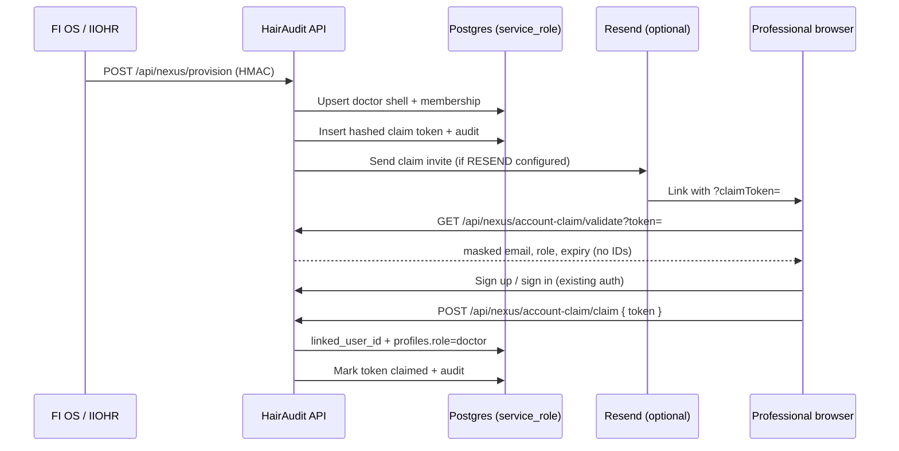

# HairAudit Nexus Account Claim (HA-NEXUS-2)

Secure invite activation for **network-provisioned doctor shells** only. Standalone doctors, clinics, and patients are out of scope.

## Problem

HA-NEXUS-1 provisions inactive doctor shells:

- `doctor_profiles.external_provider_id = global_professional_id`
- `linked_user_id = null`

Professionals need a secure way to link their HairAudit auth account to that shell **without email-only matching**.

## Architecture



## Token security model

| Property | Implementation |
|----------|----------------|
| Generation | `randomBytes(32)` hex |
| Storage | SHA-256(`HA_ACCOUNT_CLAIM_TOKEN_SECRET` + `:` + token) |
| Plaintext | Never stored, never logged |
| Comparison | Constant-time hash compare |
| Lifetime | 7 days default, single-use |
| Active tokens | One unclaimed/unrevoked token per `doctor_profile_id` |
| DB access | `service_role` only (RLS enabled, no public policies) |

## Account claim lifecycle

1. **Provision** — Nexus webhook creates/updates shell; `ensureClaimTokenForUnlinkedNexusDoctor()` mints token if none active.
2. **Invite** — Email sent via existing `sendEmail()` when a new token is created (`RESEND_API_KEY` optional; logs if missing).
3. **Validate** — Public GET returns safe metadata only.
4. **Authenticate** — User signs up/signs in via existing Supabase auth (no SSO/OIDC).
5. **Claim** — Authenticated POST links `doctor_profiles.linked_user_id` when token matches `global_professional_id`.
6. **Access** — `evaluateProfessionalAccess()` still enforces Nexus approval + entitlements after link.

### Invalid outcomes (audited)

- Expired, revoked, already claimed, malformed token
- Profile already linked to another user
- User already has a different doctor profile
- Patient or clinic role conflict (no silent elevation)

## Routes

| Method | Path | Auth | Purpose |
|--------|------|------|---------|
| `GET` | `/api/nexus/account-claim/validate?token=` | Public (rate-limited) | Safe invite preview |
| `POST` | `/api/nexus/account-claim/claim` | Session required | Link shell to auth user |

### Validate response (safe fields only)

```json
{
  "valid": true,
  "role": "doctor",
  "maskedEmail": "s***@c***.example.com",
  "expiresAt": "2026-07-09T12:00:00.000Z"
}
```

Invalid: `reason` ∈ `not_found` | `expired` | `revoked` | `already_claimed` | `malformed`

**Never returned:** `global_professional_id`, `doctor_profile_id`, full email, raw metadata.

## Server functions

| Function | Purpose |
|----------|---------|
| `createClaimTokenForDoctorProfile()` | Mint token; supersede prior active tokens |
| `revokeClaimTokensForDoctorProfile()` | Revoke active tokens + audit |
| `getClaimStatusForDoctorProfile()` | Admin/service status read |
| `validateAccountClaimToken()` | Public validation |
| `claimAccountWithToken()` | Authenticated linking |

## Database tables

### `hairaudit_account_claim_tokens`

Tracks hashed invite tokens tied to `doctor_profile_id` + `global_professional_id`.

### `hairaudit_account_link_audit`

Append-only audit: `token_created`, `token_resent`, `token_claimed`, `token_expired`, `token_revoked`, `claim_failed`.

## Environment variables

| Variable | Required | Description |
|----------|----------|-------------|
| `HA_ACCOUNT_CLAIM_TOKEN_SECRET` | Production | Pepper for SHA-256 token hashing (≥16 chars recommended) |
| `RESEND_API_KEY` | Optional | Sends claim invite emails |
| `NOTIFICATION_FROM_EMAIL` | Optional | From address for invite emails |

## FI OS / IIOHR handoff (future)

No upstream changes required for HA-NEXUS-2. Expected flow:

1. FI OS / IIOHR continues `POST /api/nexus/provision` as today.
2. HairAudit auto-mints claim token + sends invite email.
3. Optional future: FI OS requests `getClaimStatusForDoctorProfile()` via admin/service API for support dashboards.

## Why email-only linking is forbidden

Email is informational and can diverge across systems (typos, aliases, shared inboxes). Granting professional access from email alone would allow account takeover of network doctor shells. HA-NEXUS-2 requires a single-use secret bound to `global_professional_id` + `doctor_profile_id`.

## Tests

```bash
pnpm test:nexus
```

See `src/lib/nexus/accountClaim.test.ts`.

## Scope boundaries

| In scope | Out of scope |
|----------|--------------|
| Network-provisioned doctors | Standalone doctor signup |
| Inactive shell linking | Clinic provisioning (HA-NEXUS-3) |
| Token + audit tables | Patient bridge (HA-PATIENT-BRIDGE-1) |
| Claim validate/claim APIs | SSO/OIDC |
