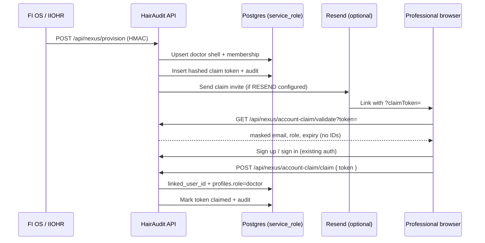

# HairAudit Nexus Account Claim (HA-NEXUS-2 / HA-NEXUS-3)

Secure invite activation for **network-provisioned professional shells** (doctors and clinics). Standalone signup paths remain available for both roles; patients are out of scope.

## Problem

HA-NEXUS-1/3 provision inactive shells:

- Doctors: `doctor_profiles.external_provider_id = global_professional_id`, `linked_user_id = null`
- Clinics: `clinic_profiles.external_clinic_id = global_clinic_id`, `linked_user_id = null`

Professionals need a secure way to link their HairAudit auth account to that shell **without email-only matching**.

## Architecture



## Token security model

| Property | Implementation |
|----------|----------------|
| Generation | `randomBytes(32)` hex |
| Storage | SHA-256(`HA_ACCOUNT_CLAIM_TOKEN_SECRET` + `:` + token) |
| Plaintext | Never stored, never logged |
| Comparison | Constant-time hash compare |
| Lifetime | 7 days default, single-use |
| Active tokens | One unclaimed/unrevoked token per subject profile |
| Subject types | `claim_subject_type`: `doctor` \| `clinic` |
| DB access | `service_role` only (RLS enabled, no public policies) |

## Account claim lifecycle

1. **Provision** — Nexus webhook creates/updates shell; `ensureClaimTokenForUnlinkedNexusDoctor()` or `ensureClaimTokenForUnlinkedNexusClinic()` mints token if none active.
2. **Invite** — Email sent via existing `sendEmail()` when a new token is created (`RESEND_API_KEY` optional; logs if missing).
3. **Validate** — Public GET returns safe metadata only.
4. **Authenticate** — User signs up/signs in via existing Supabase auth (no SSO/OIDC).
5. **Claim** — Authenticated POST links profile when token matches durable external anchor.
6. **Access** — `evaluateProfessionalAccess()` enforces Nexus approval + entitlements (doctor or clinic membership tables).

### Invalid outcomes (audited)

- Expired, revoked, already claimed, malformed token
- Profile already linked to another user
- User already has a different doctor/clinic profile
- Patient role conflict (no silent elevation)
- Doctor ↔ clinic role conflict (no cross-subject claim)

## Routes

| Method | Path | Auth | Purpose |
|--------|------|------|---------|
| `GET` | `/api/nexus/account-claim/validate?token=` | Public (rate-limited) | Safe invite preview |
| `POST` | `/api/nexus/account-claim/claim` | Session required | Link shell to auth user |

### Validate response (safe fields only)

```json
{
  "valid": true,
  "subjectType": "doctor",
  "role": "doctor",
  "displayName": "hair_surgeon",
  "maskedEmail": "s***@c***.example.com",
  "expiresAt": "2026-07-09T12:00:00.000Z"
}
```

Clinic invites return `subjectType: "clinic"` and `displayName` set to the clinic name. Never returned: `global_clinic_id`, `clinic_profile_id`, full email, raw metadata.

Invalid: `reason` ∈ `not_found` | `expired` | `revoked` | `already_claimed` | `malformed`

**Never returned:** `global_professional_id`, `doctor_profile_id`, full email, raw metadata.

## Server functions

| Function | Purpose |
|----------|---------|
| `createClaimTokenForDoctorProfile()` | Mint token; supersede prior active tokens |
| `revokeClaimTokensForDoctorProfile()` | Revoke active tokens + audit |
| `getClaimStatusForDoctorProfile()` | Admin/service status read |
| `validateAccountClaimToken()` | Public validation |
| `claimAccountWithToken()` | Authenticated linking |

## Database tables

### `hairaudit_account_claim_tokens`

Tracks hashed invite tokens tied to `doctor_profile_id` + `global_professional_id`.

### `hairaudit_account_link_audit`

Append-only audit: `token_created`, `token_resent`, `token_claimed`, `token_expired`, `token_revoked`, `claim_failed`.

## Environment variables

| Variable | Required | Description |
|----------|----------|-------------|
| `HA_ACCOUNT_CLAIM_TOKEN_SECRET` | Production | Pepper for SHA-256 token hashing (≥16 chars recommended) |
| `RESEND_API_KEY` | Optional | Sends claim invite emails |
| `NOTIFICATION_FROM_EMAIL` | Optional | From address for invite emails |

## FI OS / IIOHR handoff (future)

No upstream changes required for HA-NEXUS-2. Expected flow:

1. FI OS / IIOHR continues `POST /api/nexus/provision` as today.
2. HairAudit auto-mints claim token + sends invite email.
3. Optional future: FI OS requests `getClaimStatusForDoctorProfile()` via admin/service API for support dashboards.

## Why email-only linking is forbidden

Email is informational and can diverge across systems (typos, aliases, shared inboxes). Granting professional access from email alone would allow account takeover of network doctor shells. HA-NEXUS-2 requires a single-use secret bound to `global_professional_id` + `doctor_profile_id`.

## Tests

```bash
pnpm test:nexus
pnpm test:account-claim-ui
```

See `src/lib/nexus/accountClaim.test.ts` and `tests/accountClaimUi.test.ts`.

## Invite link UI flow (HA-NEXUS-2B)

Entry point: `/signup?claimToken=<plaintext-token>` (also supported on `/login?claimToken=` for sign-in continuation).

1. Browser calls `GET /api/nexus/account-claim/validate?token=` and renders `ClaimInvitePanel` with safe preview fields only.
2. User creates an account or signs in via existing Supabase auth (no SSO).
3. `claimToken` is preserved in the URL and `sessionStorage` (`hairaudit:account_claim_token`) across email-confirm / OAuth / magic-link handoffs.
4. After session is established, the client calls `POST /api/nexus/account-claim/claim` with `{ token }` only.
5. On success, user is redirected to `/dashboard/doctor`. On failure, a safe error is shown and no access is granted.

### UI components

| Piece | Location |
|-------|----------|
| `ClaimInvitePanel` | `src/components/nexus/ClaimInvitePanel.tsx` |
| `useClaimTokenValidation` | `src/lib/nexus/useClaimTokenValidation.ts` |
| `claimAccountAfterAuth` | `src/lib/nexus/claimAccountAfterAuth.ts` |

### Operator note

Provisioning always mints a hashed claim token in Postgres when a new network doctor shell is unlinked. Email delivery via Resend is optional — if `RESEND_API_KEY` is not configured, the token still exists server-side and can be handed to the professional through your support channel (never log or expose plaintext tokens in application logs).

### Troubleshooting

| Symptom | Likely cause | Action |
|---------|--------------|--------|
| “Invite expired” | Token past 7-day TTL | Re-provision or admin re-send (future) |
| “Already used” | Token consumed | User should sign in normally |
| “Revoked” | Superseded by newer token | Send latest invite link |
| Claim fails after sign-in | Role conflict (patient/clinic) or profile already linked | Use a fresh doctor account or contact support |

## Scope boundaries

| In scope | Out of scope |
|----------|--------------|
| Network-provisioned doctors and clinics | Standalone signup (unchanged; not claim-gated) |
| Inactive shell linking by durable external anchor | Email-only linking |
| Token + audit tables (doctor \| clinic) | Patient bridge (HA-PATIENT-BRIDGE-1) |
| Claim validate/claim APIs | SSO/OIDC |
| Clinic invite UI (HA-NEXUS-3) | FI OS / IIOHR sender implementation |
